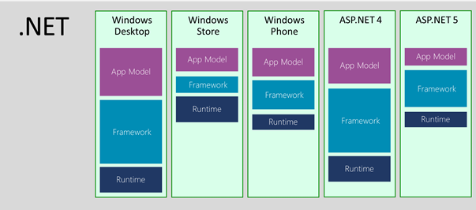
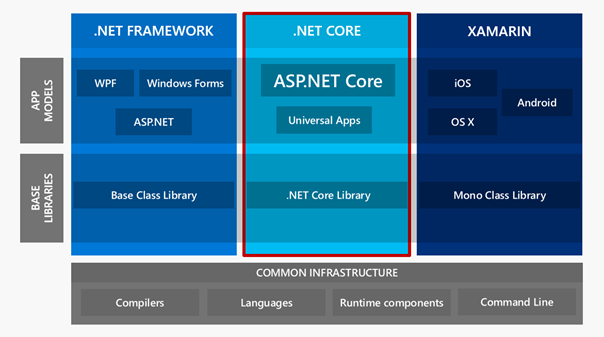
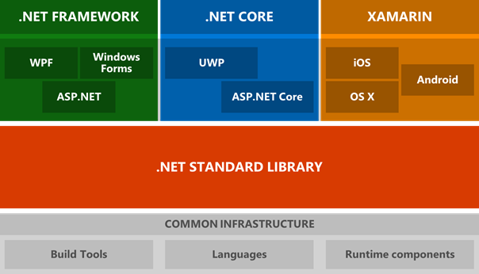
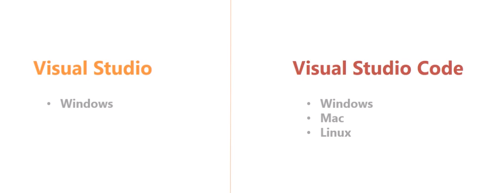
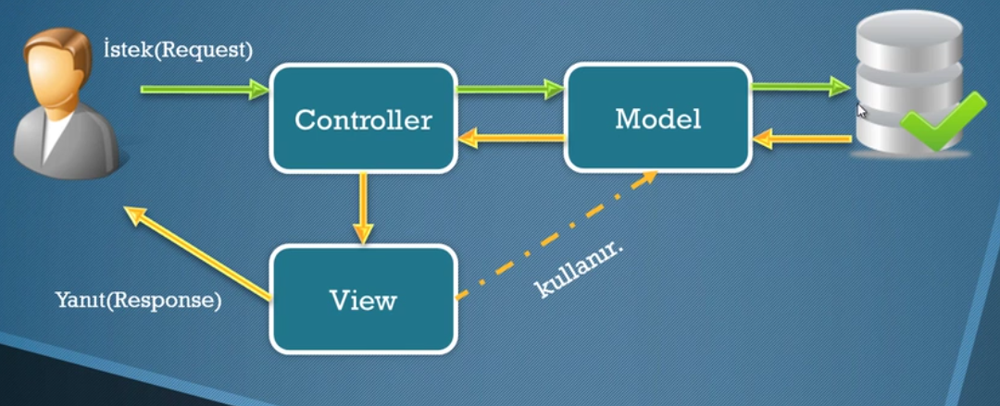

## ASP .NET Core MVC PROGRAMLAMAYA GİRİŞ

### 01 - .NET Core ve .NET Standart Nedir?

- .NET Core öncesinde kullanılan .NET Framework yapısı, aşağıdaki resimden de görüleceği üzere, birbirinden bağımsız olarak geliştirilen yapılarından oluşan bir platformdu.
- Bu nedenle her bir yapının kendine ait farklı kütüphaneleri, frameworkleri ve runtime'ları vardı.
- Ayrıca bu yapılar sadece belirli bir işletim sistemi üzerinde (çoğunlukla Windows) çalışıyordu.
- Geliştirilen kütüphaneler de genel olarak yapıya özgü geliştiriliyordu.

<p align="center">
    
</p>

- Hem Cross-platform uygulama geliştirmenin hem de open-source projelerin yükselişi ile birlikte, .NET mimarisi de kökten bir dönüşüme girmiştir.
- .NET Core ile birlikte .NET mimarisi;
    - Cross-Platform geliştirmeyi ve deployment'ı destekleyen, 
    - [Açık kaynak kodlu](https://github.com/aspnet/home),
    - Web programları, web servisleri, IoT programları ve mobil program arka-planlaması yapılabilen,
    - Herhangi bir editör ile herhangi bir işletim sisteminde (Windows, MacOS, Linux) geliştirme yapılabilen,
    - Docker desteği olan,
    - IIS dışında herhangi bir web server kullanıma uygun bir yapı haline gelmiştir.
- .NET Core ile .NET Framework arasındaki temel farklar;
    - .NET Core aslında tek bir uygulama modeli içermektedir : Console Application.
        - Bu yapıya yeni servisler eklenerek, farklı yapılar ortaya çıkarılmaktadır.
    - Buna karşın, .NET Framewok üzerinde, yukarıdaki şekilde de görüldüğü üzere, her yapı birbirinden farklıdır.

Aşağıdaki resimden de görüleceği üzere, .NET Core yapısı ortaya çıktıktan sonra da bazı sorunlar devam etti. Bu sorunların en temelinde, .NET Core ve diğer yapılar için kullanılan kütüphane yapılarının birbirinden bağımsız olmasıydı. Bu sorundan ötürü Microsoft, `.NET Standart` adlı yapıyı çıkarıp, tüm kütüphane yapılarını bu çatı altında toplamıştır. Bu sayede herhangi bir platform için sadece bir kütüphane yapısı kullanılabilir hale gelmiştir.

| <center>.NET Standart Öncesi</center> | <center>.NET Standart Sonrası</center> |
| --- | --- |
| <p align="center"></p> | <p align="center"></p> |

#### .NET Core ile .NET Framework Arasındaki Teknik Farklar

- Artık Core yapısı içinde özel dizinler bulunmamaktadır. (Örn: App_Code, App_Data vs.)
- Core yapısı içinde eskiden kullanılan html helper metotlar yerine `TagHelpers`'lar ve `ViewComponents` yapıları gelmektedir.
- Statik dosya yapısı `wwwroot` dizini içine taşınmıştır.

### 02 - Core Geliştirme Ortamları

- Windows
    - Visual Studio 2017 veya 2015
        - 2017 kurarken dil paketinin EN seçilmesine dikkat edilmelidir.
        - 2015 sürümünde default Core 1.1 gelmektedir, bunun upgrade edilmesi gerekir.
    - VS Code
    - NET Core 2.0 SDK
        - https://www.microsoft.com/net/download/
    - Version görüntüleme
        - `dotnet --version`
    - VS üzerinden yeni proje açarken Core 2.0 seçeneği geliyorsa işlemler başlarıyla gerçekleşmiştir.

- Mac ve Linux
    - VS Code
        - Kurulması tavsiye edilen eklentiler:
            - ASP.NET Core Snippets
            - C#
    - NET Core 2.0 SDK
        - https://www.microsoft.com/net/download/

<p align="center">
    
</p>

### 03 - MVC Pattern Nedir?

- Design Pattern
- Kurallar düzenidir / Kalıptır.
- Belirli kurallar ve düzenleri sabitleyerek projenin işleyişini ve - takım çalışmasını kolaylaştırır.
- İlk olarak 1979 yılında Trygve Reenskaug ortaya atılmıştır. - (Microsoft’un kurulumu 1975)
- MVC nasıl çalışır?

<p align="center">
    
</p>

### 04 - İlk Projeyi Oluşturma

- Visual Studio ile örnek proje açma
- VS Code ile proje oluşturma (Terminal üzerinden)
    - `dotnet new --help`
        - Şablonları gösterir.
    - `dotnet new <şablon ismi>`
        - Seçili şablon dosyalarını oluşturur.
    - `dotnet run`
        - Projeyi çalıştırır.
- İlk projenin ayarlamalarının yapılması ve basit bir MVC sayfası
    - MVC yapısına uygun olarak ilk `Hello World` uygulaması yapılması.
- İlk ayarlamada `Startup.cs` dosyasının içeriği aşağıdaki gibi olmalıdır:

```cs
using Microsoft.AspNetCore.Builder;
using Microsoft.AspNetCore.Hosting;
using Microsoft.Extensions.Configuration;
using Microsoft.Extensions.DependencyInjection;

namespace WebApplication1
{
    public class Startup
    {
        public IConfiguration Configuration { get; }

        public Startup(IConfiguration configuration)
        {
            Configuration = configuration;
        }

        public void ConfigureServices(IServiceCollection services)
        {
            // Mvc servisini aktifleştiriyoruz.
            services.AddMvc();
        }

        public void Configure(IApplicationBuilder app, IHostingEnvironment env)
        {
            // Sadece development adımında aktif olmasını istediğimiz kısımları buraya yazıyoruz.
            if (env.IsDevelopment()) 
            {
                // Hata gösterimini açan metottur.
                app.UseDeveloperExceptionPage();
            }

            // wwwroot dizini altındaki statik dosyaları kullanmamızı sağlar.
            app.UseStaticFiles();

            // Status kod sayfalarının gösterimini sağlar.
            app.UseStatusCodePages();

            // MVC yapımız için default bir route tanımlaması yaparız.
            // Başka bir yöntem olarak aşağıdaki ifade de kullanılabilir.
            // app.UseMvcWithDefaultRoute();
            app.UseMvc(routes =>
            {
                routes.MapRoute(
                    name: "default",
                    template: "{controller=Home}/{action=Index}/{id?}");
            });
        }
    }
}
```

### 05 - Projenin Dosya Düzeni
- `Controllers`, `Views`, `Models`
    - MVC yapısındaki dizinlerdir.
- `wwwroot`
    - Bu dizin, bizim statik dosyalarımızın bulunduğu alandır.
    - Js, css ve resim dosyaları burada bulunur.
    - Bu kısmı erişime açmak için `Startup.cs` dosyası içindeki `Configure` metodunun içine aşağıdaki kod satırı girilmelidir.
        - `app.UseStaticFiles();`
    - Bu dizin içine eklenen herhangi bir öğeye `~/` üzerinden ulaşabiliriz.
        - Örn : `wwwroot>img>01.jpg` dosyasını eklemek için;
        - `` olarak cshtml dosyasına ekleme yapılabilir.
- `Dependencies`
    - Projeye eklenen paketlerin bulunduğu kısımdır. 
    - Her paket yönetim programı için bir tane dizin oluşturulur.
    - Paket yönetim programlarının oluşturduğu dosya değiştirilirse veya direk olarak paketler kendi arayüzlerinden indirilirse, buraya otomatik olarak eklenir.
    - Buradan paketlerin üzerine tıklanarak kaldırma ve güncelleme işlemleri yapılabilir.
- `Program.cs`
    - Programın ilk çalışmaya başladığı dosyadır. 
    - Program çalıştırılınca, `Program.cs` içinde bulunan `Main()` metodu çalışır ve devamında ayarlar vs. yüklenerek program tam çalışır hale gelir.
- `Startup.cs`
    - Program içindeki tüm ana ayarlamaların yapıldığı dosyadır.
    - İçinde temel olarak iki metot bulundurur.
        - `ConfigureServices()`
            - Program servislerinin ayarlamalarının yapıldığı alandır.
            - Web host, `Configure()` metodunu çağırmadan önce, ayarlamaları yapması için bu metodu çalıştırır.
            - Opsiyoneldir.
        - `Configure()`
            - Programa gelen isteklerin (request) işlenmesi için gerekli yol haritasının çizildiği alandır.
            - Zorunludur.

### 06 - Paket Yönetimi

#### NuGet Package Manager
- .NET Framework yapısında biz paketleri Nuget Manager ile indiriyorduk ve temel paketlerin hepsi ayrı ayrı indiriliyordu.
- .NET Core ile birlikte, bu temel paketlerin hepsi tek bir paket altında toplanıp projeye dahil edilmiştir.
- Bu paketi `Dependencies > NuGet > Microsoft.AspNetCore.All` altından görebiliriz.
- Bu paketler internet üzerinden indirilmiş değildir, sadece referans olarak durmaktadırlar.
- Proje içinde kullanılan paketler otomatik algılanıp, publish edildiğinde sadece bu paketlerin dll dosyaları projeye dahil edilecektir.
- Bu paketlerin ayar dosyasını, projeye sağ tıklayıp `Edit <proje_ismi>.csproj` altında da düzenleyebiliriz.

#### Bower Package Manager
- Harici paketleri NuGet ile kurmanın yanında, .NET Core ile gelen başka bir paket yöneticisi olan `Bower` paket yöneticisiyle de paketleri kurabiliriz.
- `Project > Manage Bower Packages...` yolunu kullanarak bower paketlerini yükleyebiliriz.
- Bunun dışında manuel olarak da yükleme yapılabilir.
- Bunun için yapmamız gereken, öncelikle `bower.json` dosyasını oluşturmaktır.
- Bunu iki şekilde yapabiliriz:
    1. Projeye sağ tıklayıp `Add > New Item > Bower Configuration File` yolunu takip ederek dosyayı dahil edebiliriz.
    2. Projeye sağ tıklayıp `Add > New Item > Json File` kısmından `bower.json` isminde bir dosya ekliyoruz.
        - Dosyanın içine aşağıdaki örnek kodları ekliyoruz.

```json
{
  "name": "asp.net",
  "private": true,
  "dependencies": {
    "bootstrap": "4.0.0"
  }
}
```

- Tüm kullanılabilir bower paketleri için : https://bower.io/search/ 
- Dosyayı kaydettiğimiz zaman otomatik olarak paketler projeye eklenecektir.
- Eklenen paketleri `Dependences > Bower` altından görebiliriz.
- Projeye eklenen bower dosyaları otomatik olarak `wwwroot/lib` altında oluşturulur. Dosyaların yükleneceği yolu değiştirmek için ;
    - `bower.json` dosyasının altında `.bowerrc` dosyasının içinden `directory` kısmını değiştiriyoruz.
    - Eğer proje içinde bu dosya yoksa;
        - Projeye sağ tıklayıp `Add > New Item > Json File` kısmından `.bowerrc` isminde bir dosya ekliyoruz.
        - Dosyanın içine aşağıdaki örnek kodları ekliyoruz.

```json
{
  "directory": "wwwroot/lib"
}
```

#### Node Package Manager (NPM)
- Eklenecek.
