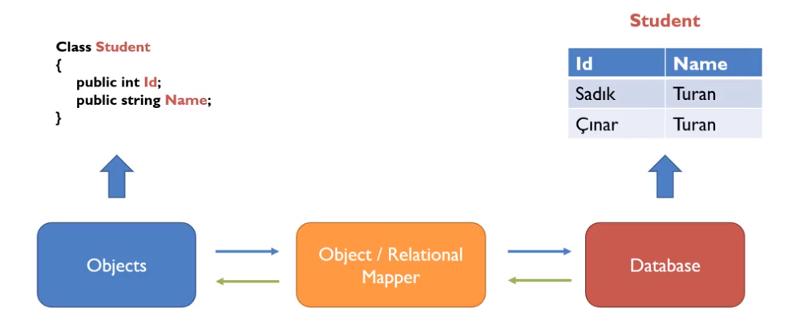
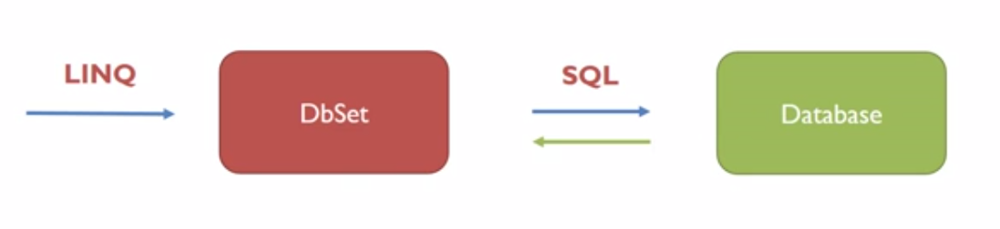
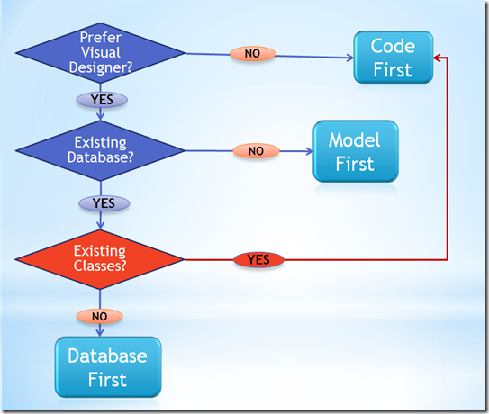

## DATABASE ENTEGRASYONU

### 01 – ORM (Object Relational Mapping) Nedir?
- İlişkisel veritabanı (RDBMS) ile nesneye yönelik programlanın (OOP) arasında bir tür köprü özelliği gören ve ilişkisel veritabanındaki bilgilerimizi yönetmek için, nesne modellerimizi kullandığımız bir tekniktir/metodtur.
- Avantajları : 
    - Nesneye yönelik bir programlama metodu sunuyor.
    - Yazılan kodun veritabanı çeşidiyle bağımlılığı yok (Oracle, SQL Server, MySQL vs)
    - SQL/JDBC bilmenize/yazmanıza gerek kalmadan çok kısa bir zamanda ve de çok daha az kod ile veritabanına bağlı bir uygulama yapabilirsiniz.
    - ORM araçlarının çoğu Open Source (Açık kaynak kodlu – yani bedava)
    - ORM araçları, programcılara bir çok kolaylık sağlıyor ve içinde barındırdığı ek desteklerle bir çok sık görülen sorunlara çözüm sunuyor. (polymorphism, caching, transaksiyon, vs)
    - Çok daha iyi test edilebilir kod yazmamızı sağlar.
- ORM kullanırken nelere dikkat edilmeli:
    - Lazy loading özelliğini iyi bir şekilde kullanın. Her zaman çekilmesi gerekmeyen verileri lazy olarak çekin.
    - Caching mekanızmasını iyi anlayın ve gereksinimlere gore değiştirin.
    - Çok karmaşık ORM sınıf modelleri yapmaktan kaçının.
    - Veritabanınızdaki tablo şemanızı en iyi şekilde tasarlayın ki, nesne modeliniz ona göre uygun ve performanslı çalışsın. Kötü tasarlanmış bir veritabanı şeması, hangi ORM aracı seçilirse seçilsin efektif şekilde çalışmaz. Gerekirse veritabanınızı iyi bir DBA (DataBase Administrator) tarafından kontrol ettirin.
    - Verileri çekerken mümkün olduğu sürece pagination (sayfalandırma) kullanmaya çalışın. Böylelikle tüm bilgileri bir anda almanıza gerek kalmamış olacak.
    - Transaksiyon, concurrency batch processing ve locking mekanızmalarını, yazılımınıza en uygun şekilde configure edin.
- Transaction Özelliği
    - Database işlemleri öncelikle ORM katmanında gerçekleştirilir, sonra database üzerine SaveChanges yapılır.
    - Bu sayade verilerin CRUD işlemlerinde herhangi bir hata çıkması sonucu oluşan yarıda kesilme ve verilerin bir kısmının db üzerine kayıt edilmesi sorunu ortadan kalkar.
    - Veriler biz `SaveChanges()` metodunu çalıştırmayana kadar db üzerine kaydedilmez.
    - Bu yüzden işlemler bittiğinde bu metodun çalıştırılması unutulmamalıdır.
- Her yazılım dilinin web framework'ünde dahili veya harici ORM bulunur.
- ORM kullanmak, database işlemlerimizi daha hızlı yapmamızı ve TSQL kodlarıyla uğraşmamamızı sağlar. Biz CRUD işlemlerimizi tamamen OOP yapısına bağlı olarak modeller üzerinden yaparken, arka planda ORM sayesinde bu işlemler TSQL yapısına çevrilip işlenir.
- .NET Core içinde, ORM olarak Entity Framework kullanmaktayız.
- .NET Framework ile programlama yaparken harici olarak indirdiğimiz Entity Framework, .NET Core ile birlikte standart bir kütüphane olarak dahili gelir.

<p align="center">
    
</p>

<p align="center">
    
</p>

### 02 - Entity Framework İle Code First Yaklaşımı
- Entity Framework mimarisinde temelde üç adet yaklaşım mevcuttur.
    - **Database First :** Öncelikle db tasarlanır ve ilgili db üzerinde tablolar oluşturulur. Daha sonrasında bu tablo yapıları program içinde çekilerek (ADO.NET ile) üzerinde CRUD işlemleri yapılır.
        - Eğer hali hazırda bir veritabanımız varsa ve bu veritabanı uzun zamandır kullanılıyorsa bu yaklaşım tercih edilir. 
        - Bu yaklaşım diğer yaklaşımların aksine zaten olan bir veritabanı üzerinden çalışma yapılması mantığına göre işler. Tabi bu yaklaşımı daha önce veritabanınız olmasada kullanabilirsiniz, bunun için veritabanını klasik yöntemlere göre sql server üzerinden oluşturmalısınız. 
        - Bu yöntemde database üzerinde herhangi bir değişiklik yapmak istersek, sql server üzerinden manual olarak yapmalıyız. Bu durumun projeye yansıması içinse "update model from database" tıklamamız gerekli.
    - **Model First :** Database tablolarının kodlar olmadan model yapılarıyla hazırlanması ve bu modellerden database'in oluşturulmasıdır.
        - Eğer bir veritabanına sahip değilseniz, direk visual studio üzerinden model kullanarak oluşturabilirsiniz. Burada gerçekleştirdiğimiz değişiklikleri sql'e tanıtmak için "generate database from" tıklamamız gerekir. 
        - Eğer kod yada sql yazmayı sevmiyorsanız, bu yöntemi tercih edebilirsiniz. Bu yöntemde genellikle kodlama yerine design ile çalışırsınız. 
        - Projeniz çok sayıda tablo içeriyor ve kompleks bir yapıya sahipse bu yöntem kullanışlı olacaktır. Büyük çaplı kurumsal projelerde tercih edilebilir.
    - **Code First :** DB tasarımı yapıldıktan sonra, bu yapılar OOP yapısına uygun olarak modellenir, daha sonra bu modeller üzerinden db tabloları ilgili database üzerinde oluşturulur.
        - Bu yöntemde design yapmak yerine kodlama yapıyorsunuz. 
        - Bu yaklaşım ile tüm kontrol elinizde oluyor, diğer yaklaşımlardaki gibi arka tarafta otomatik kodlar üretilmiyor. Yazmış olduğunuz kodlar veritabanını ve tablolarınızı oluşturacaktır.
        - Tablo sayısı az olan projelerde kullanılması tercih ediliyor.
        - Code First yapısında programlama dilindeki “class” yapıları veritabanındaki “tablo” yapılarına, “property” yapıları ise veritabanındaki “kolon” yapılarına denk gelmektedir.
        - Ayrıca Attribute’lar sayesinde veritabanı yapılarına Validationlar uygulanabilmekte ve kolonlara belirli şartlar veyahut kısıtlamalar koyulabilmektedir.

<p align="center">
    
</p>

### 03 - Dependency Injection
- DI, proje yapısı içinde bağımlılıkları en aza indirmek için kullandığımız yapılardır.
- Dependency Injection yapısı ile database işlemleri yapmak için izlenmesi gereken yol:
    1. Database tablolarını oluşturacak `Model (Entity)` oluşturulması
    2. Veritabanı bağlantısını sağlayacak `Context` sınıfının oluşturulması
    3. Migration işlemleri
    4. Bu modelleri kullanabilmek için yazılacak `Interface` oluşturulması
    5. Interface'lerin implament edilip db işlemlerini yapan `Repository` oluşturulması
    6. Interface ve Repository bağlantısının `Dependency Injection` ile `Startup.cs` içinde yapılması
    7. Controller içinde DI ile interface'in çekilmesi

###  ADIM 01 - Veritabanı Sınıflarını ( Entities ) Oluşturma
- Tabloları oluştururken models dizini altında yeni bir `Entities` dizini açılıp kullanılabileceği gibi, yeni bir class library projesi de açılarak modellemeler oluşturulabilir.
- Modellemeler oluşturulurken dikkat edilmesi gerekenler:
    - Her modelin bir ID'si olmalıdır.
        - Proporty belirtilirken `ID` veya `<modelName>ID` isimlendirmelerinden biri verildiğinde, otomatik olarak bu kısım primary key olarak alınır.
        - Bunlar dışında başka bir isim verilirse, property üstüne attribute olarak `[Key]` paramatresi verilmelidir.
    - Modeller içinde foreign key bağlamaları varsa, bu foreign key ID'leri ayrıca tekrar yazılmalıdır. Bu işlem CRUD işlemlerinde kolaylık sağlamaktadır.
    - Modeller bittiğinde validation kısımlarının da yazıldığına emin olunulmalıdır.
    - Database üzerine tablolar oluşturulurken tablo isimlerini custom olarak girmek istiyorsak, clas üstüne attribute olarak `[Table(<tablo_adi>)]` yazılabilir.
- Tablolar arasındaki ilişkileri tanımlama
    - Bire bir ilişki
    - Bire çok ilişki
        - Tek bağlantının yapıldığı sınıf içinde, elle foreing key tanımlaması yapılmalıdır.
    - Çoka çok ilişki
        - Çoka çok ilişki, .NET Framework sürümünde, iki tabloya da List olarak `Navigation Property` verildiğinde otomatik olarak ara tablo oluşuyordu.
        - .NET Core sürümünün şu anki versiyonunda bu durum söz konusu olmadığı için bu tabloyu elle eklememiz gerekmektedir.
        - Bunun için;
            - Öncelikle her iki tablonun bağlı olduğu bir ara tablo oluşlturulmalı.
            - Bu tablonun ID değer almasına gerek yoktur.
            - Tablonun Context dosyasına DBSet olarak eklenmesine gerek yoktur.
            - Fakat OnModelBuilder ile, tablolar oluşurken bu tablonun iki tane key yapısına sahip olduğu belirtilmelidir.

```cs
// Table 1
public class Table1
{
    public int ID { get; set; }
    public string area { get; set; }

    public List<Table1Table2> Table1Table2s { get; set; }
}

// Table 2
public class Table2
{
    public int ID { get; set; }
    public string area { get; set; }

    public List<Table1Table2> Table1Table2s { get; set; }
}

// Ara Tablo
public class Table1Table2
{
    public int Table1ID { get; set; }
    public Table1 Table1 { get; set; }

    public int Table2ID { get; set; }
    public Table2 Table2 { get; set; }
}

// Context Sınıfı
public class ProjectContext : DbContext
{
    public ProjectContext(DbContextOptions<ProjectContext> option)
        : base(option) { }

    public DbSet<Table1> Table1s { get; set; }
    public DbSet<Table2> Table2s { get; set; }

    protected override void OnModelCreating(ModelBuilder modelBuilder)
    {
        modelBuilder.Entity<Table1Table2>().HasKey(k => new { k.Table1ID, k.Table2ID });
    }
}
```

- Bağlı tabloların çekilmesi için kullanılan yöntemler ( Bonus Not )

### ADIM 02 - Veritabanı İşlemlerini Yönetecek Sınıfı ( Context ) Oluşturma
- Context sınıfı models dizini altında oluşturulacaksa, `DAL` adlı bir dizin oluşturup içinde oluşturmak, entity modellerle karıştırılmaması açısından daha uygundur. Bunun dışında ayrı bir `class library` projesi eklenerek de context sınıfı burada oluşturulabilir.
- Context sınıfı `DbContext` sınıfından kalıtım almalıdır.
- Context sınıfı oluşturulurken üç adımdan oluştuğuna dikkat edilmelidir.
    1. DB bağlantısını oluşturacak ctor metodun yazılması
    2. İlgili modellerin bağlanması
    3. Bağlantı ayarlarının startup.cs içinde yapılandırılması

#### Ctor Metodunun Oluşturulması ve Modellerin bağlanması
- Database üzerinde tablo olarak bulunmasını istediğimiz ve daha öncesinde tanımladığımız modelleri, Context dosyamız içinde property olarak belirtmemiz lazım.
- Bu property girdilerinin tiplerinin `DbSet<model>` olmasına dikkat edilmelidir.
- Model isimlendirmesi yapılırken, çoğul ifadelerin kullanılması, yazım açısından daha iyi olacaktır.
- Buradaki isimlendirmeler, db üzerindeki tablo isimlendirmesinde kullanılır.

```cs
using Microsoft.EntityFrameworkCore;
using Project.Models.Entities;

namespace Project.Models.DAL
{
    public class ProjectContext : DbContext
    {
        // Database bağlantısının oluşturulması
		public ProjectContext(DbContextOptions<ProjectContext> options)
			:base(options) { }

        // Modellerin tanıtılması
		public DbSet<Person> People { get; set; }
		public DbSet<Address> Addresses { get; set; }
	}
}
```

#### Bağlantı Stringinin Oluşturulması ve Yapılandırılması
- Database bağlantısı için bir `connection string`'e ihtiyacımız vardır.
- MSSQL için bu bağlantı string'i:
    - `"SERVER=<server_adı> ; DATABASE=<db_adı> ; UID=<kullanıcı_adı> ; PWD=<parola>"`
    - Buradaki bilgiler MSSQL kurulurken oluşturulan bilgilerdir.
    - Database girişinde windows auth ile giriş sağlanıyorsa, UID ve PWD yerine `Integrated Security=true` yazılarak giriş yapılabilir.
- `Startup.cs` dosyasına aşağıdaki ayarlamaları giriyoruz.

```cs
public void ConfigureServices(IServiceCollection services)
{
    services.AddMvc();

    var connection = "Server=.;Database=_coreDeneme;UID=sa;PWD=123";
    services.AddDbContext<ProjectContext>(
        option => option.UseSqlServer(connection)
        );
}
```

- Eğer bağlantı string'inin projenin içerisinde değil de, ayrı bir config dosyası olarak yazılmasını istiyorsak, bunun için projeye `appsettings.json` adlı bir dosyayı eklememiz gerekmektedir.
    - Bunun için projeye sağ tıklayıp `Add > New Item > ASP.NET Configuration File` dosyası eklenebilir.
    - Bu dosya, eski sürümdeki `WebConfig` dosyasının yerine geçmektedir.
    - Dosya eklendiğinde, içinde default olarak şöyle bir json yapısı gelmektedir:

```json
{
  "ConnectionStrings": {
    "DefaultConnection": "Server=(localdb)\\MSSQLLocalDB;Database=_CHANGE_ME;Trusted_Connection=True;MultipleActiveResultSets=true"
  }
}
```

- Buradaki `DefaultConnection`, kendi yazacağımız bağlantı stringi ile değiştirildikten sonra `Startup.cs` içinde bağlantı için artık şöyle bir kod yazılabilir.

```cs
public IConfiguration Configuration { get; }

public Startup(IConfiguration configuration)
{
    Configuration = configuration;
}

public void ConfigureServices(IServiceCollection services)
{
    services.AddMvc();
    services.AddDbContext<EfCoreDbContext>(
        option => option.UseSqlServer(
            Configuration.GetConnectionString("DefaultConnection")
            ));
}
```

### ADIM 03 - Migration İşlemleri
- Migration işlemleri, database ile modellerimizin arasındaki farkın bulunması ve database güncellenmeden önce hangi işlemlerin yapılacağının çözümlendiği işlemdir.
- Migration işlemleri iki yolla yapılabilir:
    1. Projenin ana dizininde `cmd` açılarak 
        - Migration işlemleri cmd ile yapılacaksa bir kütüphanenenin kurulması gerekiyor. Bunun için projeye sağ tıklayıp `Edit <project>.csproj` yoluna gelip aşağıdaki kütüphaneyi `ItemGroup` tagları arasına ekliyoruz.
        - `<DotNetCliToolReference Include="Microsoft.EntityFrameworkCore.Tools.DotNet" Version="2.0.0"></DotNetCliToolReference>`
    2. `Nuget Package Console` ile 
- Yapılacak migration işlemleri ve kodları şu şekildedir : 
    - Yeni bir migration eklemek
        - Komut satırı
            - `dotnet ef migrations add <migration_name>`
        - NPM Console
            - `Add-Migration <migration_name>`
    - Database güncelleme
        - Komut satırı
            - `dotnet ef database update`
        - NPM Console
            - `Update-Database`

### ADIM 04 - Modellere Ait Interface Oluşturulması
- Her tabloya ait CRUD işlemleri için bir interface tanımlanmalıdır.
- Bu tanımlanan interface, kullanılan database teknolojisindan bağımsız olarak, kodlarımızı yazmamızı sağlar.

```cs
public interface IPersonRepository
{
    Person GetById(int personID);
    IQueryable<Person> Persons { get; }
    void CreatePerson(Person person);
    void UpdatePerson(Person person);
    void DeletePerson(int personID);
}
```

### ADIM 05 - Interface'lerden Implament Edilen Repository Oluşturulması
```cs
public class SQLPersonRepository : IPersonRepository
{
    private ProjectContext _context;

    public SQLPersonRepository(ProjectContext context)
    {
        _context = context;
    }

    public Person GetById(int personID)
        => _context.People.FirstOrDefault(k => k.ID == personID);

    public IQueryable<Person> Persons 
        => _context.People;

    public void CreatePerson(Person person)
    {
        _context.People.Add(person);
        _context.SaveChanges();
    }

    public void UpdatePerson(Person person)
    {
        _context.Update(person);
        _context.SaveChanges();
    }

    public void DeletePerson(int personID)
    {
        Person person = GetById(personID);
        _context.Remove(person);
        _context.SaveChanges();
    }
}
```

### ADIM 06 - Dependency Injection Bağlantısı

```cs
public void ConfigureServices(IServiceCollection services)
{
    // Burada bağlantıyı yapıyoruz
    services.AddTransient<IPersonRepository, SQLPersonRepository>();

    var connection = "Server=.;Database=_coreDeneme;UID=sa;PWD=123";
    services.AddDbContext<ProjectContext>(option => option.UseSqlServer(connection));

    services.AddMvc();
}
```

### Kurumsal Mimari Yapısıyla Core Projesi Oluştumak

- Buradaki amaç, projemiz içindeki her katmanı ayrı bir library içinde kullanarak, projenin yönetilebilirliğini arttırmaktır.
- Bunun için, bir solution içinde açamız gereken temelde 3 tane proje vardır. Bunların biri `CoreMVC`, diğer ikisi ise `Class Library`'dir.
- Projeler oluşturulduktan sonra, her projenin kullanılan projeye göre birbirine referans vermesi gerekmektedir.
- Migration işlemleri yapılırken, assembly yolunun WebUI içinde olduğunu ayar olarak belirtmemiz gerekmektedir.

```cs
public void ConfigureServices(IServiceCollection services)
{
    services.AddMvc();
    services.AddDbContext<EfCoreDbContext>(
        option => option.UseSqlServer(
            Configuration.GetConnectionString("EfCoreDb"),
            b => b.MigrationsAssembly("Project.WebUI")
            ));
}
```

1. **Project.WebUI** (Core MVC Projesi)
    - Bu proje, bizim çalışacak main projemizdir.
    - Diğer projelerden referans alır ve kullanır.
    - Projenin çalışması için bu projenin start-up project olarak seçilmesi gereklidir.
2. **Project.Entity** (Class Library)
    - İçinde db modellerimizin olduğu sınıftır.
3. **Project.Data** (Class Library)
    - Database bağlantılarının bulunduğu alandır.
    - Database bağlantısı yapılacağı için içinde Entity Framework Core kütüphanesi bulunmalıdır.
        - NPM içinden `Microsoft.EntityFrameworkCore.SqlServer` kütüphanesi kurulabilir.
        - NPM Console üzerinden `Install-Package Microsoft.EntityFrameworkCore.SqlServer` komutu çalıştırılarak kurulabilir.
        - `Project.Data.csproj` dosyası içindeki `<itemgroup>` tagları içine aşağıdaki satır eklenebilir.
            - `<PackageReference Include="Microsoft.EntityFrameworkCore.SqlServer" Version="2.0.1" />`
            - ya da 
            - `<PackageReference Include="Microsoft.AspNetCore.All" Version="2.0.5" />`
    - İçinde 2 tane dizin bulundurur.
        1. **Abstract** 
            - Interface'lerin tanımlandığı alandır.
        2. **Concrete**
            - Database bağlantıları için yazılacak `Context` ve `Repository` sınıflarının olacağı klasördür.
            - Projeye dahil edilecek her bir db ve orm teknolojisi için ayrı bir klasör oluşturur. 
            - Bu klasörler içinde bağlantı için gereken Context ve Repository sınıfları oluşturulur.