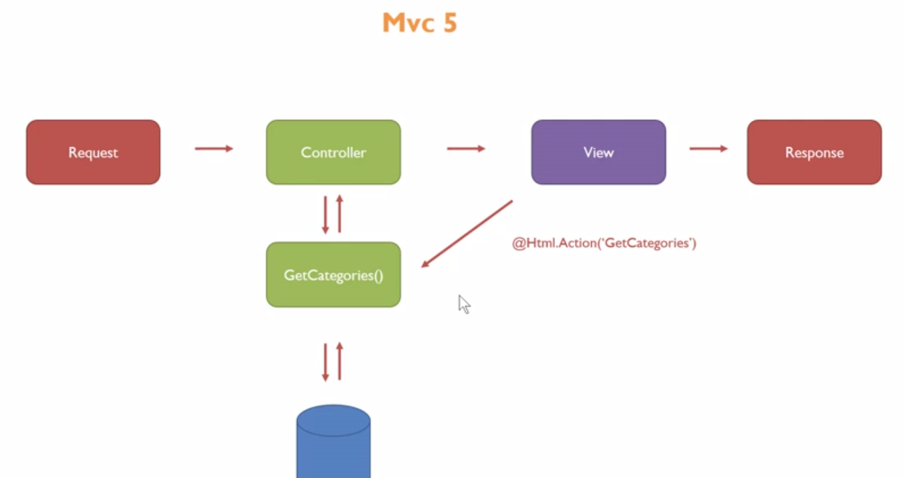
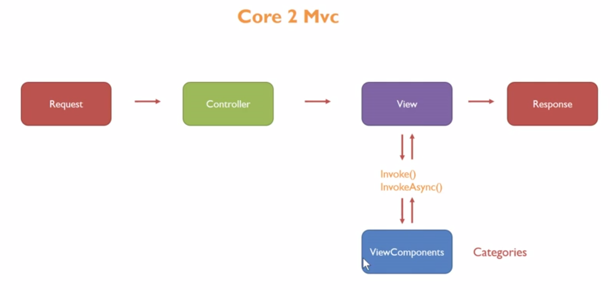

## MODELS VE MODEL BINDING

### 01 - Controller'dan View'e Model ile Veri Taşıma
- Controller üzerinden View'a veri taşınırken, `ViewBag` veya `TempData` gibi aracılarla veri gönderebileceğimiz gibi, bunları bir model üzerinde toplayıp, modeli de gönderebilir.
- Modeli oluşturduktan sonra, döndüreceğimiz View metodu içinde parametre olarak veririz.
- Önemli olan ve unutulmaması gereken, **model gönderildikten sonra, ilgili cshtml sayfasında da bu model tanıtılmalıdır.** Aksi halde gönderdiğimiz modele view üzerinden ulaşamayız.
- Controller üzerinden gönderilen model yapısı ile view üzerinde tanıtılan model yapısı arasında fark varsa, uygulama hata verecektir.
- Örnekler : 
    - String, int gibi bilinen türleri gönderme
    - Tek model gönderme
    - Model listesi gönderme

```cs
// Model yapısı
public class Person
{
    public int ID { get; set; }
    public string Name { get; set; }
    public string Surname { get; set; }

    public int AddressID { get; set; }
    public Address Address { get; set; }
}
```

```cs
// Controller
public IActionResult Index()
{
    List<Person> persons = new List<Person>()
    {
        new Person() { Name = "Serhat", Surname = "Sönmez" },
        new Person() { Name = "Ahmet", Surname = "Mete" },
        new Person() { Name = "Ayşe", Surname = "Demir" }
    };
    return View(persons);
}
```

```html
<!-- Html -->
@model List<Project.Models.Person>
  
<table>
    <tr>
        <th>Name</th>
        <th>Surname</th>
    </tr>
    @foreach (var person in Model)
    {
        <tr>
            <td>@person.Name</td>
            <td>@person.Surname</td>
        </tr>
    }
</table>

<!--    Name	Surname
        Serhat	Sönmez
        Ahmet	Mete
        Ayşe	Demir       -->
```

### 02 - Model Binding
- View'den Controller'a bilgi taşırken, taşınan bilgileri Query String, Form veya Route Data içinden almak yerine, direk parametre olarak almamıza olanak veren yapıdır. 
- Girilen parametre değerleri `key` kabul edilerek, sırasıyla `FormData > RouteData > QueryString` içinde aranır ve bir değere ulaşılırsa bu değer value olarak alınır.
- Parametreler alınırken gelen tüm değerler `string` türündedir. Fakat alınacak key değerinin türü değiştirilerek, alındığı zaman direk tür dönüşümü yapılması sağlanabilir.
    - **NOT:** Burada tür dönüşümü yapılmazsa veya non-nullable bir parametreye (örn: int, datetime...) null değeri gönderilirse, ASP.NET Framework sürümünde hata alınıyordu. Fakat .NET Core sürümünde, hata alınmaz, bu değerler kendi default değerleri olarak atanır (örn: int için 0 alınır).
- Parametre değeri olarak model de alınabilir.
    - Bu durumda, modelin içindeki property'ler yukarıda belirtilen sırayla aranır ve uygun olanlar alınır.

```html
<!-- Form Data-->
<form method="post" action="/Product/Save">
    <input type="text" name="productName" />
    <input type="number" name="count" />
    <input type="submit" value="Send" />
</form>

<!-- Route Data -->
<!-- Route : {controller}/{action}/{id?} -->
<a href="/Product/Get/3">Get Product</a>

<!-- Query String -->
<a href="/Product/search?q=new_products">New Products</a>
```

- Model Binding olmadan alma

```cs
// Form Data
public IActionResult Save()
{
    string productName = Request.Form["productName"];
    int count = int.Parse(Request.Form["count"].ToString());
    return View();
}

// Route Data
public IActionResult Get()
{
    int id = int.Parse(RouteData.Values["id"]?.ToString());
    return View();
}

// Query String
public IActionResult Search()
{
    string q = Request.Query["q"];
    return View();
}
```

- Model Binding ile alma

```cs
// Form Data
public IActionResult Save(string productName, double count)
    => View();

// Route Data
public IActionResult Get(int id)
    => View();

// Query String
public IActionResult Search(string q)
    => View();
```

### 03 - View'den Controller'a Model ile Veri Taşıma

- Html üzerinden form üzerinden gönderilen bilgiler, model binding ile controller üzerinden alınırken, model yapısına çevrilebilir.
- Bu yöntemle, istenen model yapısı içindeki property isimleri, FormData içinde araştırılır ve uygun olanlar modele bağlanır.
- Modele bağlama işleminin doğru şekilde olması için, form içindeki input yapılarının name yapıları, model içindeki property isimlerinin birebir aynısı olmalıdır. Aksi durumda bağlantı sağlanmaz.
- Bu html isimlendirme kısmında bize kolaylık sağlayan iki yapı bulunur :
    - Html helpers
    - Tag helpers
- Bu iki yapı kullanıldığında, view kısmının üstünde tanımlanan model yapısından property isimleri çekilip input alanlarına name olarak verilir.

Model yapısı : 
```cs
namespace Project.Models
{
    public class Person
    {
        public string Name { get; set; }
        public string Surname { get; set; }
    }
}
```

Html ile veri gönderilirken kullanılabilir yöntemler:

```html
<!-- Metot 1 / HTML Form -->
<form method="post">
    <input type="text" name="Name" />
    <input type="text" name="Surname" />
    <input type="submit" value="Send" />
</form>

<!-- Metot 2 / Html Helpers -->
@model Project.Models.Person
@using (Html.BeginForm())
{
    @Html.TextBoxFor(k => k.Name)
    @Html.TextBoxFor(k => k.Surname)
    <input type="submit" value="Send!" />
}

<!-- Metot 3 / Tag Helpers -->
@model Project.Models.Person
<form method="post">
    <input asp-for="Name" />
    <input asp-for="Surname" />
    <input type="submit" value="Save!" />
</form>

```

Gönderilen verileri controller üzerinden alma yöntemleri:

```cs
// Metot 1 - Model binding ile ayrı ayrı alma
[HttpPost]
public IActionResult Index(string Name, string Surname)
    => return View();

// Metot 2 - Model binding ile model yapısına çevirip alma
 [HttpPost]
public IActionResult Index(Person person)
    => return View();
```

> **NOT:** Birleşik modeller veya modelin foreign key ile bağlandığı başka bir model kullanıldığında, durum aynıdır. 
> - Eğer manuel olarak isimlendirme yapılacaksa, her seviye nokta ile ayrılır. 
> - Controller üzerinden model çekilirken, tüm modelin çekilmesi gereklidir. Sadece form içinde kullanılan model çekilmeye çalışılırsa, uyumsuzluktan dolayı null değer alınır.

### 04 - List Binding

- Controller'a aynı key ismine sahip birden fazla eleman gönderilirse, bunlar dizi veya liste olarak bind edilip alınabilir.

```html
@model List<string>
<form method="post">
    <input type="text" name="names" />
    <input type="text" name="names" />
    <input type="text" name="names" />
    <input type="submit" value="submit" />
</form>
```

```cs
public IActionResult Form(string[] names)
    => View();

// veya

public IActionResult Form(List<string> names)
    => View();
```

- Aynı yapı birden çok model gönderimi için de kullanılabilir.

```html
@model List<Customer>
<form method="post">
    <input type="text" name="[0].name" />
    <input type="text" name="[0].surname" />

    <input type="text" name="[1].name" />
    <input type="text" name="[1].surname" />

    <input type="text" name="[2].name" />
    <input type="text" name="[2].surname" />

    <input type="submit" value="submit" />
</form>
```

```cs
public IActionResult Form(List<Customer> customers)
    => View();
```

### 05 - ViewModel Oluşturma
- Birleşik Model oluşturma
- Birleşik Modelleri Controller’dan View’a gönderme
- Birleşik Modelleri View’dan Controller’a gönderme

### 06 - Partial View'ı Model Yapısı Kullanarak Gönderme
- Partial View yapısı ikinci parametre olarak bir model alarak dinamik bir hale bürünür.
- Bu yapıyı html içinde `Html.Partial(<partial>, <model>)` olarak kullanabileceğimiz gibi, ActionResult üzerinden `PartialView(<partial>, <model>)` return ederek de kullanabiliriz.
- Core MVC yapısında bu yapılar yerine `View Components` yapıları gelmiştir.(bkz. ilgili ders notu)

<p align="center">
    
</p>

<p align="center">
    
</p>