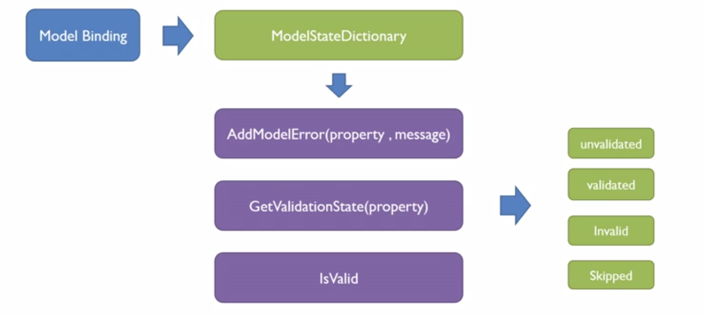

## VALIDATION İŞLEMLERİ

### 01 - Giriş
- Validation kontrolü yapmanın önemi
    - Web zaafiyetlerinin en büyük nedeni input validation eksikliğinden kaynaklanır.
    - Ayrıca kullanıcıdan alınan bilgilerin bazı kurallara uyması gerekir. Örn: Parolanın minimum uzunluğu gibi.
- .NET kütüphanesi ile, alınan her verinin validation kontrolünün ayrı ayrı yapılma zorluğu ortadan kalkmış ve bu validationların model üzerinden attribute olarak tanımlanması sağlanmıştır.
    - Bu şekilde validation yapıldığıda, kontrol etmek için sadece `ModelState` üzerinde `IsValid` kontrolü yapmak yeterlidir.

> **NOT:** .NET Framework sürümünde, inputa gidilen html kodları otomatik olarak elimine edilip zararlı kod olarak algılanıyordu. .NET Core sürümünde ise bu kontrol yapılmamaktadır. Buna dikkat edilmesi gerekir.

- Validation işlemleri `Model Binding` tarafından yönetilir.
- Model Binding, `ModelStateDictionary` ile çalışır.
    - Bu dictionary içinde temel olarak kullanacağımız 3 yapı vardır: 
        1. **AddModelError:** Model içindeki herhangi bir property üzerine error eklemeyi sağlar
        2. **GetValidationStat:** Validasyon durumunu gösterir. Enum değer döndürür.
        3. **IsValid:** Validasyon işlemi sonucunda `true` veya `false` döndürür.
- ModelState ifadesi, programı debug modda çalıştırınca, `QuickWatch` penceresinden izlenebilir.

<p align="center">
    
</p>

İleriki kısımlarda kullanılacak model ve html yapısı yapısı:
```cs
public class Register
{
    public string UserName { get; set; }
    public string EMail { get; set; }
    public string Password { get; set; }
    public DateTime Birthday { get; set; }
    public bool TermsAccepted { get; set; }
}
```

```html
@model Register

<form method="post">

    <div class="text-danger" asp-validation-summary="ModelOnly"></div>

    <div class="form-group">
        <label asp-for="UserName"></label>
        <input asp-for="UserName" class="form-control" />
        <span asp-validation-for="UserName"></span>        
    </div>

    <div class="form-group">
        <label asp-for="Password"></label>
        <input asp-for="Password" class="form-control" />
        <span asp-validation-for="Password"></span>
    </div>

    <div class="form-group">
        <label asp-for="EMail"></label>
        <input asp-for="EMail" class="form-control" />
        <span asp-validation-for="EMail"></span>
    </div>

    <input type="submit" value="Send!" class="btn btn-success btn-sm" />
</form>
```

### 02 - Modele Error Mesaj Ekleme

- Modele error mesaj eklemek için, `ModelState`'in `AddModelError` metodu kullanılır.
- İlk parametre olarak eklenmesini istediğimiz property ismini, ikinci olarak da eklemek istediğimiz mesajı gireriz.
    - Property ismini `string` veya `nameof()` ifadeleriyle verebiliriz.
- **NOT:** Model içindeki herhangi bir property'ye bu metot ile hata mesajı eklendiğinde, `IsValid` işlemi false döner.

```cs
[HttpPost]
public IActionResult Index(Register model)
{
    if (model.Password != null && model.Password.Length < 6)
        ModelState.AddModelError("Password", "Parola en az 6 karakterli olmalıdır.");

    if (!model.EMail.Contains("@"))
        ModelState.AddModelError(nameof(Register.EMail), "Girilen değer email olmalıdır!");

    return View(model);
}
```

### 03 - Form Üzerinde Validation Hata Mesajlarını Gösterme

- Bir model üzerinde Validation kontrolü yapıldığında, model üzerine hata mesajları da eklenir.
    - Bu nedenle hata mesajlarının gösterilmesi için, *validation kontrolünden geçmiş modelin* tekrar sayfaya gönderilmesi gereklidir.
- Bu model daha sonra tekrar View üzerine gönderildiğinde, inputlar `asp-for` ile tanımlanmışsa, input'un class yapısına `.input-validation-error` isminde bir class daha eklenir.
    - Bu class ismi kullanılarak, hatalı validation hatası yakalanmış inputlar üzerinde css düzenlemesi yapılabilir. Örn, input kırmızı border ile işaretlenebilir.  
- Validation işlemlerini her input için ayrı ayrı göstermek istiyorsak, `asp-validation-for` yapısı kullanılmalıdır.

```html
<div class="form-group">
    <label asp-for="EMail"></label>
    <input asp-for="EMail" class="form-control" />
    <span asp-validation-for="EMail"></span>
</div>
```

- Validation mesajlarının tamamının gösterilmesi için, `asp-validation-summary` yapısı kullanılmalıdır. Bu yapının 3 tane enum değeri vardır: 
    - **All:** Property ve model errorların hepsi gösterilir.
    - **ModelOnly:** Property errorları dahil edilmez, sadece model'e manuel eklenen hata mesajları gösterilir.
    - **None:** Herhangi bir hata mesajı gösterilmez.

```html
<div class="text-danger" asp-validation-summary="All"></div>
```

### 04 - MetaData Etiketleri

- MetaData etiketleri .NET içinde aşağıdaki `ComponentModel` ve `DataAnnotations` kütüphaneleri içinde bulunur.

```cs
using System.ComponentModel;
using System.ComponentModel.DataAnnotations;
using Microsoft.AspNetCore.Mvc;
```

- **DiplayName()** : View içinde label tagı `asp-for` ile kullanıldığında otomatik olarak burdaki ismi çeker. 
    - Bu sayede, tüm formlar üzerinde aynı ismi kullanmış oluruz ve düzenlemesi daha kolay olur.
- **Required()** : Bir alanın girilmesini zorunlu kılmak için kullanılır.
- **Range()** : Sayısal ifadelerin belirli bir double aralıkta girilmesini sağlamak için kullanılır.
    - ilk parametresine farklı bir type verilerek, double ifadeler dışında da bir aralık girilmesi sağlanabilir.
        - **NOT:** Bu, client-side bazen validation sorunları çıkarabiliyor. 

```cs
[Range(0, 100)]
// veya 
[Range(typeof(bool), "true", "true")]
```

- **MinLength()** : String ifadenin min uzunluğunu belirlemek için kullanılır.
- **MaxLength()** : String ifadenin max uzunluğunu belirlemek için kullanılır.
- **DataType()** : Parametre olarak enum değerlerden biri seçilerek, client side validation hata gösterimleri için bir type yaratır.
- **Compare()** : Bir property'i başka biriyle karşılaştırmak için kullanılır. Eğer uyumsuzluk varsa hata verir. 
    - Genellikle parola kontrolü için kullanılır.
    - Parametre olarak, karşılaştırılacak property'nin string olarak ismi verilebileceği gibi, `nameof` ile otomatik olarak de çekilebilir.

```cs
[Required]
public string Password { get; set; }
[Required, Compare(nameof(Password))]
public string RePassword { get; set; }
```

- **RegularExpression()** : Bir alana regex kısıtlaması getirmemizi sağlar.
- **HiddenInput()** : Belirtilen alanın, kullanıldığı yerde `type="hidden"` olarak işaretlenmesini sağlar. 
    - Yukarıdakilerden farklı bir kütüphaneden gelir.
    - `using Microsoft.AspNetCore.Mvc;`
- **DisplayFormat()** : Sayfaya bastırılacak fotmat bilgisi belirlenir. Genellikle Tarih, Saat, Sayı formatlama gibi durumlarda kullanılır.
    - `ApplyFormatInEditMode` özelliği varsayılan olarak false durumundadır. Eğer bu formatlı görüntünün input içerisinde de görünmesini istiyorsak true yaparız.
    - `NullDisplayText` özelliğini kullanarak NULL dönen sonuçlar yerine bir not gösterilmesini sağlayabilirsiniz.

```cs
[DisplayFormat(ApplyFormatInEditMode=true, DataFormatString="{0:c}")]
public decimal Ucret { get; set; }
```

- **Remote()** : Client side validation için ilgili js dosyaları projeye eklenmişse, belirtilen endpoint'e istek yollayarak (ajax yapısı ile) kontrol işlemi yapar.
    - Daha çok kullanıcı adı veya mail gibi alanların db üzerinde bulunup bulunmadığını kontrol etmek için kullanılır.
    - Verilecek parametreler : 
        - **action** : Gideceği action ismi
        - **controller** : Gideceği controller ismi
        - **area** : Belirtilmesi gerekiyorsa area ismi
        - **HttpMethod** : Gideceği endpoint'e hangi türde bir istek yapılacağını string olarak belirtiriz.
        - **ErrorMessage** : Eğer gittiği endpointten herhangi bir ifade dönmezse, bu hata mesajı yazdırılır.
    - İstek yaptığı endpointten json olarak `true` veya hata mesajı bekler. True ifadesi gidildiğinde validation yapar, diğer durumlarda validation yapmaz ve hata mesajını yazdırır.
    - Endpoint üzerinden property ismi parametre olarak alınıp kullanılabilir.
    - **NOT:** Bu metodun çalışması için client-side validation kütüphanelerinin yüklenmesi zorunludur. 
    - Doc : https://docs.microsoft.com/en-us/aspnet/core/mvc/models/validation#remote-validation
    - **NOT:** Eğer database tabloları MVC projesinin dışında başka bir proje içinde oluşturulmuşsa, ilgili proje içine `Microsoft.AspNetCore.Mvc` kütüphanesinin eklenmesi gerekmektedir.

```
<ItemGroup>
  <PackageReference Include="Microsoft.AspNetCore.Mvc" Version="2.0.3" />
</ItemGroup>
```

```cs
// Model
[Remote(action:"UserNameCheck", controller:"Validation", HttpMethod = "Post", ErrorMessage = "Remote control not checked!")]
public string UserName { get; set; }

// Controller
[HttpPost]
public IActionResult UserNameCheck(string UserName)
{
    if (usernameCheck(UserName))
        return Json(true);
    else
        return Json($"{UserName} does exists.");
}
```

*Modelin son yapısı:*
```cs
using Microsoft.AspNetCore.Mvc;
using System.ComponentModel;
using System.ComponentModel.DataAnnotations;

namespace WebApplication1.Models
{
    public class Register
    {
        [DisplayName("User Name"), Required, MinLength(4), MaxLength(10)]
        [Remote(action:"Check", controller:"Validation", HttpMethod = "Post", ErrorMessage = "Remote control not checked!")]
        public string UserName { get; set; }

        [DisplayName("E-Mail"), DataType(DataType.EmailAddress)]
        [RegularExpression("^[a-z0-9]+@mail.com$")]
        public string EMail { get; set; }

        [DisplayName("Password"), Required, DataType(DataType.Password)]
        public string Password { get; set; }

        [DisplayName("RePassword"), Required, DataType(DataType.Password), Compare(nameof(Password))]
        public string RePassword { get; set; }

        [DisplayName("Accepting Terms"), Required]
        public bool TermsAccepted { get; set; }

        [DisplayFormat(DataFormatString = "{0:MMM dd, yyyy}")]
        public DateTime BithDate { get; set; }
    }
}
```

### 05 - Custom Error Message

- Validasyon elemanlarının hepsinde default bir hata mesajı vardır.
- Bu default değerler dışında kendimiz hata mesajı yazmak istediğimizde, MetaData'ların `ErrorMessage` parametresinden yararlanırız.
- Bu parametre tüm MetaData'larda bulunur.
- **NOT:** Hatalar gösterilirken, yazılma sırası dikkate alınır. İlk uyumsuzluk hatası gösterilir, düzeltilirse diğerleri gösterilir.
- Hata mesajı içinde dinamik öğeler kullanabiliriz. Bunu, hata mesajının ilgili yerine `{<sayi>}` ile yaparız. Bu yapıda;
    - `{0}` : Display name veya bu yoksa property ismini belirtir.
    - `{1}, {2}...` : Attribute içindeki değerlerin sırayla numaralandırmasıdır.

```cs
[DisplayName("Age"), Range(18, 100, ErrorMessage = "{0} must be between {1} and {2}...")]
public int Age { get; set; }

// Result:
// Age must be between 18 and 100...
```

### 06 - Custom Property Validation Method

- Default validation MetaData'ların yetmediği yerde kendi metotlarımızı yazabiliriz.
- Bunun için `Attribute` ve `IModelValidator` sınıf ve interface'lerinden türeyen bir sınıfa ihtiyacımız var.
- Bu sınıfın isminin `-Attribute` ile bitmesi gerekmektedir.
- Interface'i implament ettiğimizda gelen `Validate` metodunu, aşağıdaki örneğe uygun yazdığımızda, artık bunu attribute olarak kullanabiliriz.
- Model içinde kullandığımız attribute değerine `context.Model` üzerinden ulaşıp kontrol edebiliriz.
- **NOT:** Bu yapı sadece server-side validation için kullanılabilir, client-side validation işlemleri bunu görmeyecektir.

```cs
public class DateValidationAttribute : Attribute, IModelValidator
{
    public string ErrorMessage { get; set; }
        = "Date cannot be bigger than today!";

    public IEnumerable<ModelValidationResult> Validate(ModelValidationContext context)
    {
        var date = context.Model as DateTime?;

        // Block
        if (!date.HasValue || date > DateTime.Now)
            return new List<ModelValidationResult>
            { new ModelValidationResult("", ErrorMessage) };

        // Allow
        else
            return Enumerable.Empty<ModelValidationResult>();
    }
}
```

Attribute olarak kullanımı : 
```cs
[DataType(DataType.Date), DateValidation]
public DateTime BithDate { get; set; }
```

### 07 - Validation Kontrolü

- Formdan gelen verilerin, kaydedilmeden önce, validation işlemlerinden geçip geçmediğini kontrol etme yönetimidir.
- Bunun için `ModelState` sınıfının `IsValid` özelliği kullanılır.
- Formlarla yapılan her işlemde bu kontrol mutlaka yapılmalıdır.
- Eğer validasyon işlemleri yeterli değilse, IsValid kontrolünden sonra if yapıları kullanılarak gerekli validasyonlar tekrar kontrol edilir.

```cs
[ValidateAntiForgeryToken]
[HttpPost]
public ActionResult Index(Register model)
{
    if (ModelState.IsValid)
    {
        // Save process
    }
    return View(model);
}
```

### 08 - Client Side Validation

- Şu ana kadar yapılan işlemler, programın server-side validation işlemleri yapmaları için gerekli adımlardı.
- Server-side validation yapıldığında, sayfanın formu server üzerine göndermesi ve doğal olarak sayfanın yenilenmesi gerekmekteydi.
- Client-side validation yapıldığında ise, server üzerine bilgiler gönderilmeden önce validation işlemleri kontrol edilir ve bilgiler valid değilse form gönderilmez.
- View içinde `asp-for` ile form verileri çekildiğinde, element içine aynı zamanda `data-val-` özellikleri otomatik gelir.
- Bu elementler client-side validation için kullanılan attribute'lerdir.
- Bu attribute'lerin kullanılması ve validation yapması için projemiz içine bazı js kütüphanelerini dahil etmemiz gerekmektedir. Bunlar;
    1. JQuery
    2. JQuery-Validation
    3. JQuery-Validation-Unobtrusive
- Bu kütüphanler projeye dahil edilip, html içine yolları verildikten sonra herhangi bir işlem yapmamıza gerek yoktur. Server-side validation kontrolü yapılacaktır.
- **NOT:** Server-side validation güvensizdir. Tarayının js ayarları kapatıldığında veya tarayıcı dışında başka bir mekanizma ile bilgiler gönderildiğinde, bu validation çalışmayacaktır. Buradaki amaç sadece client tarafında daha efektif ve hızlı validation yapmaktır. **Server-side validation ve IsValid kontrolünün kesinlikle unutulmaması gereklidir!**