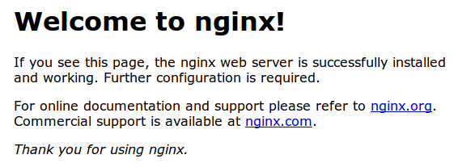

## DEPLOYMENT

- Core projesinin deployment süreci basit olarak 3 temel adımda gerçekleşir:
    1. Projenin dizine publish edilmesi ve barındıracak host üzerine gönderilmesi.
        - Publish işlemi, projenin derlenip, Release sürümünün statik dosyalarla birlikte bir dizine veya ftp üzerinden belirlenen bir alana çıkarılması işlemidir.
    2. Host üzerinde, servis oluşturulması
        - Dotnet Core projesi, temelinde bir konsol uygulaması olduğundan, server reboot veya programın çökmesi durumda tekrar başlatılması gerekmektedir.
        - Host üzerinde bu işlemler için bir servis yazıp, yukarıdaki durumlarda uygulamamızın tekrar başlatılmasını sağlamamız gerekmektedir.
    3. Reverse Proxy kurulumu
        - Core uygulaması, kendi içinde `Kestel` adlı bir web server bulundurmaktadır.
        - Kestel, tüm web server işlemlerini ve statik dosya yönlendirmesi gibi işlemleri kendi içinde oluşturmaktadır.
        - Bununla birlikte, 5000 portundan dinleme yapan Kestel'i, herhangi bir proxy aracılığıyla istediğimiz bir portu (web için genellikle 80) dinlemeye ayarlamamız gerekmektedir.
        - Bunun için genellikle kullandığımız Reverse Proxy Server'lar:
            - IIS
            - Nginx
            - Apache

### 01 - Projeyi Yayınlama Yöntemleri

Dotnet Core projeleri temel olarak iki şekilde yayınlanabilir:

- **Framework Bağımlı Yayınlama (Framework-dependent deployments - FDD)**
    - Sadece uygulama ve 3. parti bağımlılıkların yayınlanmasına dayanır.
    - .NET Core runtime bağımlılığı vardır, bu yüzden deploy ettiğimiz hedef makinede .NET Core kütüphanesinin ilgili sürümü kurulu olması gerekmektedir.
    - İşletim sistemi belirtmeye gerek yoktur. Deploy ettikten sonra, her işletim kendi işletim sistemine özgü Core runtime üzerinden çalıştırılabilir haldedir.
    - Deployment paketi, sadece gerekli olan frameworkleri barındırdığı için boyutu küçüktür.

- **Framework Bağımsız Yayınlama (Self-contained deployments - SCD)**
    - Uygulama, 3. parti bağımlılıklar ve dotnet core kütüphanelerinin birlikte deploy edilmesi yöntemidir.
    - Hedef kaynakta dotnet core kurulu olmasına gerek yoktur.
    - Dotnet core kütüphaneleri için işletim sistemi altyapıları farklı olduğundan, deploy ederken hangi işletim sistemi için deploy etmemiz gerektiğini belirtmemiz gerekmektedir.
        - [Runtime IDentifier Catalog](https://docs.microsoft.com/en-us/dotnet/core/rid-catalog)
    - Deployment paketi, FDD'ye göre daha büyük boyutludur.

### 02 - Projenin Yayınlanması

- Proje, 4 farklı şekilde yayınlanabilir:
    - Framework-dependent deployment
    - Framework-dependent deployment with third-party dependencies
    - Self-contained deployment
    - Self-contained deployment with third-party dependencies

#### i. CLI Araçları (Command-Line Interface Tools) ile yayınlama

- Projeyi CLI ile yayınlarken `dotnet publish` komutunu kullanırız.
    - Bu komutun ayrıntılı opsiyonları aşağıdaki gibidir:

```
Usage: dotnet publish [options]

Options:
  -h, --help                            Show help information.
  -o, --output <OUTPUT_DIR>             Output directory in which to place the published artifacts.
  -f, --framework <FRAMEWORK>           Target framework to publish for. The target framework has to be specified in the project file.
  -r, --runtime <RUNTIME_IDENTIFIER>    Publish the project for a given runtime. This is used when creating self-contained deployment. Default is to publish a framework-dependent app.
  -c, --configuration <CONFIGURATION>   Configuration to use for building the project.  Default for most projects is  "Debug".
  --version-suffix <VERSION_SUFFIX>     Defines the value for the $(VersionSuffix) property in the project.
  --manifest <manifest.xml>             The path to a target manifest file that contains the list of packages to be excluded from the publish step.
  --self-contained                      Publish the .NET Core runtime with your application so the runtime doesn't need to be installed on the target machine. Defaults to 'true' if a runtime identifier is specified.
  --no-restore                          Does not do an implicit restore when executing the command.
  -v, --verbosity                       Set the verbosity level of the command. Allowed values are q[uiet], m[inimal], n[ormal], d[etailed], and diag[nostic].
  --no-dependencies                     Set this flag to ignore project to project references and only restore the root project.
  --force                               Set this flag to force all dependencies to be resolved even if the last restore was successful. This is equivalent to deleting project.assets.json.

```

**Framework-dependent deployment**

- Proje bağımlılıklarının güncellenmesi
    - `[proje-adi].csproj` dosyası içinde yazdığımız bağımlılıkların indirilmesi ve güncellenmesi işleminin yapılmasıdır.
    - `dotnet restore` komutu çalıştırılır.
- Projenin derlenmesi
    - `dotnet build` komutu ile projenin son halinin derlenmesi işlemidir.
- Projenin yayınlanması
    - `dotnet publish -f netcoreapp2.0 -c Release -o CorePublish` komutu projenin yayınlanacak dosyalarının oluşturulmasını sağlar.
        - `-o` parametresi ile publish edilecek dosyaların çıkarılacağı konumu belirtiyoruz.
        - `-c` parametresi ile derlenme ayarının belirtiyoruz.
        - `-f` parametresi ile projemizin framework versiyonunu belirtiyoruz.
- Projenin çalıştırılması
    - `dotnet [app_name].dll` komutuyla, ilgili projenin dll dosyası dotnet aracılığıyla çalıştırılır.
    - Proje çalıştırıldığında, `localhost:5000` üzerinden yayın yapmaya başlar.

**Self-contained deployment**

- Projenin hedef platformlarının belirtilmesi
    - `[app_name].csproj` içine hedef platformların belirtilmesi gereklidir.
    - [Tüm platformlar için bakınız...](https://docs.microsoft.com/en-us/dotnet/core/rid-catalog)

```xml
<PropertyGroup>
    <RuntimeIdentifiers>win10-x64;osx.10.11-x64</RuntimeIdentifiers>
</PropertyGroup>
```

- Proje bağımlılıklarının güncellenmesi
    - `[proje-adi].csproj` dosyası içinde yazdığımız bağımlılıkların indirilmesi ve güncellenmesi işleminin yapılmasıdır.
    - `dotnet restore` komutu çalıştırılır.
- Projenin derlenmesi
    - `dotnet build` komutu ile projenin son halinin derlenmesi işlemidir.
- Projenin yayınlanması
    - `dotnet publish -r win10-x64 -f netcoreapp2.0 -c Release -o CorePublish` 
    - `dotnet publish -r osx.10.11-x64 -f netcoreapp2.0 -c Release -o CorePublish` 
        - `-r` parametresi ile hedef platformu belirtiyoruz.
        - `-o` parametresi ile publish edilecek dosyaların çıkarılacağı konumu belirtiyoruz.
        - `-c` parametresi ile derlenme ayarının belirtiyoruz.
        - `-f` parametresi ile projemizin framework versiyonunu belirtiyoruz.
- Projenin çalıştırılması
    - Hedef platforma özgün olarak çıkarılmış `[app_name]` veya `[app_name].exe` dosyalarından biri çalıştrırılarak programa ulaşım sağlanır.
    - Proje çalıştırıldığında, `localhost:5000` üzerinden yayın yapmaya başlar.

#### ii. Visual Studio ile Yayınlama

**Framework-dependent deployment**

- Projenin derlenmesi
    - Solution üzerine sağ tıklayıp `Build Solution` tıklanır.
- Projenin yayınlanması
    - Araç çubukları üzerinden config kısmı `Debug > Release` olarak değiştirilir.
    - Proje üzerine sağ tıklanıp `Publish` tıklanır.
    - Buradan `Folder Publish` seçilip, dosyaların çıkarılacağı konum belirlenir.
- Projenin çalıştırılması
    - `dotnet [app_name].dll` komutuyla, ilgili projenin dll dosyası dotnet aracılığıyla çalıştırılır.
    - Proje çalıştırıldığında, `localhost:5000` üzerinden yayın yapmaya başlar.

**Self-contained deployment**

- Projenin hedef platformlarının belirtilmesi
    - `[app_name].csproj` içine hedef platformların belirtilmesi gereklidir.
    - Projeye sağ tıklanıp `Edit [app_name].csproj` tıklanır.
    - [Tüm platformlar için bakınız...](https://docs.microsoft.com/en-us/dotnet/core/rid-catalog)

```xml
<PropertyGroup>
    <RuntimeIdentifiers>win10-x64;osx.10.11-x64</RuntimeIdentifiers>
</PropertyGroup>
```

- Projenin derlenmesi
    - Solution üzerine sağ tıklayıp `Build Solution` tıklanır.
- Projenin yayınlanması
    - Araç çubukları üzerinden config kısmı `Debug > Release` olarak değiştirilir.
    - Proje üzerine sağ tıklanıp `Publish` tıklanır.
    - Buradan `Folder Publish` seçilip, dosyaların çıkarılacağı konum belirlenir.
    - Alt kısımdaki `Publish` kısmının yanındaki ayarlara tıklayarak, `Create Profile` olarak değiştirilir ve tıklanır.
    - Yeni gelen pencereden `Target Location > Settings > Target Runtime` kısmından ilgili platform seçilir.
    - Pencere kapatılıp `Start` butonuna tıklanır.
- Projenin çalıştırılması
    - Hedef platforma özgün olarak çıkarılmış `[app_name]` veya `[app_name].exe` dosyalarından biri çalıştrırılarak programa ulaşım sağlanır.
    - Proje çalıştırıldığında, `localhost:5000` üzerinden yayın yapmaya başlar.

#### iii. Publish Dosyaları

- `[app-name].deps.json` : 
    - Projenin çalışma zamanındaki bağımlılıklarını bulunduran dosyadır.
    - Kompoentleri ve kütüphaneleri bulundurur.
    - Projenin çalışması için zorunlu dosyadır.
    - [Ayrıntılı Bilgi](https://github.com/dotnet/cli/blob/85ca206d84633d658d7363894c4ea9d59e515c1a/Documentation/specs/runtime-configuration-file.md)
- `[app-name].dll` : 
    - Application'ı bulunduran dosyadır.
    - Yayın yapılırken bu dosya çalıştırılır.
- `[app-name].pdb` : 
    - Debug sembollerinin bulundugu dosyadır.
    - Projenin çalışması için zorunlu değildir.
- `[app-name].runtimeconfig.json` : 
    - Uygulamanın çalışma zamanı ayarlarının bulunduğu dosyadır.
    - Projenin yazıldığı dotnet versiyonunu da barındırır.
    - [Ayrıntılı Bilgi](https://github.com/dotnet/cli/blob/85ca206d84633d658d7363894c4ea9d59e515c1a/Documentation/specs/runtime-configuration-file.md)
- `bundleconfig.json`:
    - Bundle configuration ayarlarını bulundurur.
- `appsettings.json`:
    - Bağlantı stringi, log ayaları vb gibi ayaların bulunduğu json dosyasıdır.
- `wwwroot`
    - Statik dosyaların bulundugu dizindir.

### 03 - Linux Server Ayarlamaları (Ubuntu 16.04)

#### Self-Contained Deployment

1. Proje dosyası yukarıda anlatıldığı şekilde, `Self-Contained` olarak dosyaya yayınlanır.
2. Yayınlanan dosyalar server üzerine gönderilir.
    - Bunun için sunucumuza [FTP Server kurabileceğimiz](BONUS%20-%20FTP%20Server%20Kurulumu.md) gibi, SSH üzerinden de FTP bağlantısı yapıp dosyalarınızı gönderebilirsiniz.
3. Proje kütüphanelerini ekleme ve çalıştırma
    - Proje `dotnet` dahil olmak üzere tüm kütüphane yapılarını içinde bulundurduğundan, server üzerine herhangi bir kütüphane kurmaya gerek yoktur.
    - Proje içinde gelen `libxxx.so` kitaplıklarının `ldd` komutu ile sisteme eklenmesi gerekmektedir.
    - Daha sonra uygulama dosyası direk çalıştırılarak dotnet projesinin çalıştığını görebiliriz.

```bash
# Kütüphaneleri sisteme ekleme
$ ldd lib*.so

# İstenilirse çalıştırılacak dosya yolu path olarak eklenebilir.
# "proje" > dotnet ana dosyasıdır.
$ export PATH=$PATH:/var/www/CoreProje/

# Dotnet dosyasının çalıştırılması
$ proje

Hosting environment: Production
Content root path: /var/www/CoreProje/proje
Now listening on: http://localhost:5000
Application started. Press Ctrl+C to shut down.
...
```

> **NOT:** Self-contained olarak server üzerine kopyalanmış dosyalar çalıştırıldığında hata ile karşılaşılırsa, aşağıdaki iki kütüphanenin kurulması önerilir.

```
$ ./proje 
Failed to load ***, error: libunwind.so.8: cannot open shared object file: No such file or directory
Failed to bind to CoreCLR at '/var/www/libcoreclr.so'

$ apt install libicu-dev
$ apt install libunwind-dev

$ ./proje 
warn: Microsoft.AspNetCore.DataProtection.KeyManagement.XmlKeyManager[35]
      No XML encryptor configured. Key {61d5203f-7b87-4911-bb68-126a09425473} may be persisted to storage in unencrypted form.
Hosting environment: Production
Content root path: /var/www
Now listening on: http://localhost:5000
Application started. Press Ctrl+C to shut down.
```

4. Reverse Proxy kurulur ve ayarlamaları yapılır.
5. Herhangi bir nedenden ötürü server veya uygulama kapanırsa tekrardan başlaması için gerekli olan servis dosyası oluşturulur ve çalıştırılır.

#### Framework-Dependent Deployment

1. Proje dosyası yukarıda anlatıldığı şekilde, `Framework-Dependent` olarak dosyaya yayınlanır.
2. Yayınlanan dosyalar server üzerine gönderilir.
    - Bunun için sunucumuza [FTP Server kurabileceğimiz](BONUS%20-%20FTP%20Server%20Kurulumu.md) gibi, SSH üzerinden de FTP bağlantısı yapıp dosyalarınızı gönderebilirsiniz.
3. Dotnet kütüphane kurulumları yapılır.
    - Kütüphaneler iki farklı yöntemle kurulabilir:
        1. `Dotnet Runtime` + `Dotnet Hosting` kurulabilir.
        2. Geliştirici araçları da dahil olmak üzere her şeyi bulunduran `Dotnet SDK` kurulabilir.
    - Son sürüm kütüphaneleri Linux üzerinde görüntülemek için basitçe `apt search dotnet` komutu çalıştırılabilir.

```bash
$ apt search dotnet

dotnet-hosting-2.0.8/xenial,now 2.0.8-1 amd64 [installed]
  Microsoft .NET Core 2.0.8 Linux Server Hosting

dotnet-runtime-2.1.0-rc1/xenial,now 2.1.0-rc1-1 amd64 [installed]
  Microsoft .NET Core Runtime - 2.1.0 Release Candidate 1 Microsoft.NETCore.App 2.1.0-rc1

dotnet-sdk-2.1.4/xenial 2.1.4-1 amd64
  Microsoft .NET Core SDK - 2.1.4

...

# 1. Yöntem
$ sudo apt install dotnet-runtime-2.1.0-rc1
$ sudo apt install dotnet-hosting-2.0.8

# 2. Yöntem
$ sudo apt install dotnet-sdk-2.1.4
```

4. Reverse Proxy kurulur ve ayarlamaları yapılır.
5. Herhangi bir nedenden ötürü server veya uygulama kapanırsa tekrardan başlaması için gerekli olan servis dosyası oluşturulur ve çalıştırılır.

#### Reserve Proxy Kurulumu

- Reserver proxy için **Nginx, ISS, Apache** vb. kurabilirsiniz.
- Nginx kullanımı için öncelikle Nginx kurulumunu yapıyoruz.

```
sudo apt-get install nginx
```

- Nginx'i kurduktan sonra servisini başlatmamız gerekmektedir.

```
sudo service nginx start
```

- Servisi başlattıktan sonra, server ip adresine herhangi bir yerden bağlandığımızda, aşağıdaki gibi Nginx default sayfasını görmemiz gerekmetedir. Eğer bu sayfayı görüyorsak herhangi bir hata olmadan servisin kurulduğunu anlayabiliriz.

<p align="center">
    
</p>

- Nginx kurulumunu yaptıktan sonra, default olarak 5000 portundan dinleme yapan Core projemizi, Nginx ile 80 portuna proxy yönlendirmesi yapmamız gerekmektedir.
    - Öncelikle default Nginx ayarlarının dosya ismini değiştiriyoruz
        - `mv /etc/nginx/sites-available/default /etc/nginx/sites-available/defaultOriginal`
    - Daha sonra yeniden bir ayar dosyası oluşturup aşağıdaki kodları içine yapıştırıyoruz.
        - `nano /etc/nginx/sites-available/default`

```
server {
    listen 80;
    location / {
        proxy_pass http://localhost:5000;
        proxy_http_version 1.1;
        proxy_set_header Upgrade $http_upgrade;
        proxy_set_header Connection keep-alive;
        proxy_set_header Host $http_host;
        proxy_cache_bypass $http_upgrade;
    }
}
```

- Ayarları yaptıktan sonra Nginx'i yeni ayarlarıyla test edip baştan başlatıyoruz.

```
$ sudo nginx -t
nginx: the configuration file /etc/nginx/nginx.conf syntax is ok
nginx: configuration file /etc/nginx/nginx.conf test is successful

$ sudo nginx -s reload
```

- Nginx'i tekrar başlattıktan sonra herhangi bir hata yoksa, dotnet projemizi başlatıp, server ip adresine direk bağlanıp projeye ulaşıp ulaşamadığımızı kontrol edebiliriz.


#### Servis Yazılması

- Öncelikle servise dosyasını oluşturuyoruz.

```
$ sudo nano /etc/systemd/system/core.service
```

- Daha sonrasında dosyanın içine aşağıdaki satırları ekliyoruz.
    - **Description:** Servis açıklaması
    - **WorkingDirectory:** Çalışma dizini. App dosyalarımızın olduğu dizini vermemiz gerekmektedir.
    - **ExecStart:** Konsolda uygulamamızı çalıştırmak için kullandığımız `dotnet helloworld.dll` komutunun tam yol olarak belirtildiği yerdir.
    -  
```
[Unit]
Description=Example .NET Web API App running on Ubuntu

[Service]
WorkingDirectory=/var/aspnetcore/hellomvc
ExecStart=/usr/bin/dotnet /var/aspnetcore/hellomvc/hellomvc.dll
Restart=always
RestartSec=10
SyslogIdentifier=dotnet-example
User=www-data
Environment=ASPNETCORE_ENVIRONMENT=Production
Environment=DOTNET_PRINT_TELEMETRY_MESSAGE=false

[Install]
WantedBy=multi-user.target
```

- Dosyayı kaydettikten sonra, servisi aktifleştirmemiz ve başlatmamız gerekmektedir.

```
$ systemctl enable kestrel-hellomvc.service
$ systemctl start kestrel-hellomvc.service
$ systemctl status kestrel-hellomvc.service

● kestrel-hellomvc.service - Example .NET Web API App running on Ubuntu
    Loaded: loaded (/etc/systemd/system/kestrel-hellomvc.service; enabled)
    Active: active (running) since Thu 2016-10-18 04:09:35 NZDT; 35s ago
Main PID: 9021 (dotnet)
    CGroup: /system.slice/kestrel-hellomvc.service
            └─9021 /usr/local/bin/dotnet /var/aspnetcore/hellomvc/hellomvc.dll
```

- Servisi aktifleştirdikten sonra, web uygulamamız otomatik olarak başlayacaktır.
- Servisin log dosyasına bakmak için `sudo journalctl -fu <service_name>` komutu kullanılabilir.