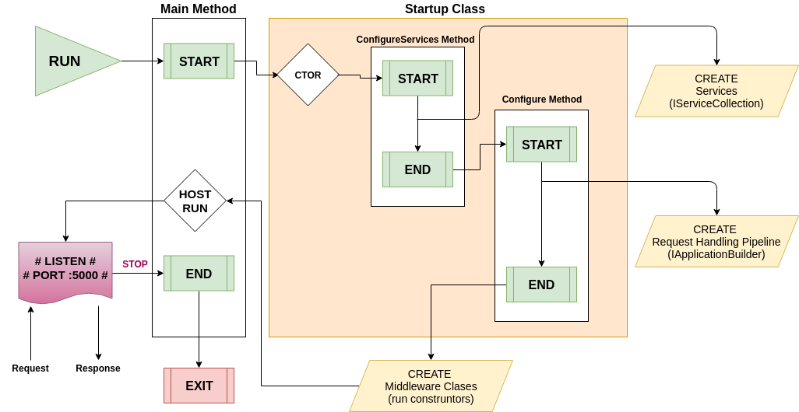

## ASP.NET CORE YAŞAM DÖNGÜSÜ

### 01 - Genel Bilgiler

- ASP.NET Core; cross-platform, yüksek performanslı, açık kaynak kodlu bir framework'tür.
- .NET Core ve .NET Framework üzerinde çalıştırılabilir.
    - ASP.NET Framework, yalnızca Windows işletim sisteminde, .NET Framework üzerinde çalışmaktadır.
- ASP.NET Core uygulaması, `Main` metodu içinde web server yaratıp kullanan bir ***console uygulamasıdır.***

```cs
using Microsoft.AspNetCore;
using Microsoft.AspNetCore.Hosting;

namespace aspnetcoreapp
{
    public class Program
    {
        public static void Main(string[] args)
        {
            BuildWebHost(args).Run();
        }

        public static IWebHost BuildWebHost(string[] args) =>
            WebHost.CreateDefaultBuilder(args)
                .UseStartup<Startup>()
                .Build();
    }
}
```

- `WebHost.CreateDefaultBuilder()` metodu, uygulamamızı üzerinde çalıştıracağımız bir host yaratır ve varsa ayarlamalar yapmamızı sağlar.
    - Bu ayarlamalar, `UseStartup()`, `UseKestrel()` gibi metotlarla yapılandırılır.
    - Default builder ayarlamsında Kestel web server otomatik olarak seçilmiş olur.
    - `Build()` ve `Run()` metotlarıyla `IWebHost` türünde bir host oluşturulup, HTTP istekleri dinlenmeye başlanır.
- Dotnet Core ile yazılmış bir programı çalıştırdığımızda, çalışma sırası aşağıdaki şemadaki gibidir.
    - NOT : Middleware'ler, program çalıştığında çalışmaz. Request geldiğinde ve response döndüğünde çalışır. 

<p align="center">
    
</p>

### 02 - Application Startup

- Main metot içinde, Host oluştururken (WebHostBuilder) kullandığımız `UseStartup()` metodu, `Request Handling Pipeline` düzenlemeleri yapmamızı sağlayan, external bir class oluşturmamızı sağlar.

- Startup class'ı public olmalı ve aşağıdaki iki metodu içermelidir.

```cs
public class Startup
{
    // This method gets called by the runtime. Use this method
    // to add services to the container.
    public void ConfigureServices(IServiceCollection services)
    {
    }

    // This method gets called by the runtime. Use this method
    // to configure the HTTP request pipeline.
    public void Configure(IApplicationBuilder app)
    {
    }
}
```

- **ConfigureServices** : Uygulamanın kullandığı servislerin (örn; ASP.NET Core MVC, Entity Framework Core, Identity) tanımlandığı yerdir.
    - Tanımlanması opsiyoneldir.
- **Configure** : Request pipeline için kullanılacak ara katmanların (middleware) belirtildiği yerdir.
    - Tanımlanması zorunludur.
- Bu metotlar, uygulama çalıştığı zaman `runtime` anında çalışırlar.

...

- Startup sınıfı kullanılacağı zaman, host tarafından sağlanan bazı bağımlılıklar enjenkte edilebilir. Bunlardan en çok kullanılanları:
    - `IHostingEnvironment` : Servisleri geliştirme ortamlarına göre özelleştirmeyi sağlar.
    - `IConfiguration` : Startup boyunca uygulama ayarları yapmamızı sağlar.

```cs
public class Startup
{
    public Startup(IHostingEnvironment env, IConfiguration config)
    {
        HostingEnvironment = env;
        Configuration = config;
    }

    public IHostingEnvironment HostingEnvironment { get; }
    public IConfiguration Configuration { get; }

    public void ConfigureServices(IServiceCollection services)
    {
        if (HostingEnvironment.IsDevelopment())
        {
            // Development configuration
        }
        else
        {
            // Staging/Production configuration
        }

        // Configuration is available during startup. Examples:
        // Configuration["key"]
        // Configuration["subsection:suboption1"]
    }
}
```

- `IHostingEnvironment` ve `ILoggerFactory`, alternatif olarak Startup metotlarına parametre olarak da verilebilir(conventions-based approach).

```cs
public class Startup
{
    public void Configure(IApplicationBuilder app, IHostingEnvironment hosting)
    {
        // ...
    }
}
```

#### ConfigureServices Metodu

- Opsiyoneldir.
- Web host tarafından, `Configure` motodu çağırılmadan önce çağırılır ve uygulamanın kullanıcı tanımlı servis ayalarının yapılmasını sağlar.
- `ConfigureServices` metodu içine yeni bir servis eklemek, bu servisi uygulama ve `Configure` için kullanılabilir yapar.
    - Bu servisler uygulama içinde `dependency injection` veya `IApplicationBuilder.ApplicationServices` aracılığıyla kullanılabilir.
- Web Host, bazı servisleri Startup metodu çağırılmadan önce düzenleyebilir. [(Ayrıntı)](https://docs.microsoft.com/en-us/aspnet/core/fundamentals/host/index?view=aspnetcore-2.0)
- Servisleri ekleme : 
    - `IServiceCollection` sınıfı içindeki `Add[Service_Name]` metotları çağırılıp servisler eklenebilir.
    - Servisler eklendiği zaman, varsa ayarları da yapılabilir.

```cs
public void ConfigureServices(IServiceCollection services)
{
    // Add framework services.
    services.AddDbContext<ApplicationDbContext>(options =>
        options.UseSqlServer(Configuration.GetConnectionString("DefaultConnection")));

    services.AddIdentity<ApplicationUser, IdentityRole>()
        .AddEntityFrameworkStores<ApplicationDbContext>()
        .AddDefaultTokenProviders();

    services.AddMvc();

    // Add application services.
    services.AddTransient<IEmailSender, AuthMessageSender>();
    services.AddTransient<ISmsSender, AuthMessageSender>();
}
```

#### Configure Metodu

- Bu metot, gelen HTTP isteğine nasıl cevap verileceğini ayarlamamızı sağlar.
    - Gelen isteğe cevap verilme sürecine (Request => Response) `Request Handling Pipeline` denir.
- Request pipeline yönetimi, `IApplicationBuilder` nesnesi üzerine `Ara katman (Middleware)` eklenmesiyle düzenlenir.
    - `IApplicationBuilder` web host tarafından üretilir ve direk olarak `Configure` metoduna yönlendirilir.
- Request pipeline, hazır gelen Core middleware'leri (developer exception page, BrowserLink, error pages, static files, and ASP.NET MVC) ile düzenlenebileceği gibi, custom middleware de yazabiliriz.
    - `IApplicationBuilder` üzerine eklenmiş `Use[middleware]` *extension* metotları middleware eklenmesi için kullanılabilir.

```cs
public void Configure(IApplicationBuilder app, IHostingEnvironment env)
{
    if (env.IsDevelopment())
    {
        app.UseDeveloperExceptionPage();
        app.UseBrowserLink();
    }
    else
    {
        app.UseExceptionHandler("/Error");
    }

    app.UseStaticFiles();

    app.UseMvc(routes =>
    {
        routes.MapRoute(
            name: "default",
            template: "{controller}/{action=Index}/{id?}");
    });
}
```

- Her eklenen middleware, kendisinden sonra gelen middleware'i çalıştırmak ya da kısa devre (short-circuiting) yaparak başka bir yere yönlendirmekle sorumludur.
    - Short-circuiting ile yönlendirilen yer, tekrar middleware'leri en baştan çağırılmasını sağlayabileceği gibi, sonrakileri atlayarak direk response da gönderebilir.

#### Convenience metot

- `ConfigureServices` ve `Configure` metotları, `Startup` sınıfı içinde tanımlanabileceği gibi, web host build edilirken de oluşturulabilir.

```cs
public class Program
{
    public static IHostingEnvironment HostingEnvironment { get; set; }
    public static IConfiguration Configuration { get; set; }

    public static void Main(string[] args)
    {
        BuildWebHost(args).Run();
    }

    public static IWebHost BuildWebHost(string[] args) =>
        WebHost.CreateDefaultBuilder(args)
            .ConfigureAppConfiguration((hostingContext, config) =>
            {
                HostingEnvironment = hostingContext.HostingEnvironment;
                Configuration = config.Build();
            })
            .ConfigureServices(services =>
            {
                services.AddMvc();
            })
            .Configure(app =>
            {
                if (HostingEnvironment.IsDevelopment())
                {
                    app.UseDeveloperExceptionPage();
                }
                else
                {
                    app.UseExceptionHandler("/Error");
                }

                // Configuration is available during startup. Examples:
                // Configuration["key"]
                // Configuration["subsection:suboption1"]

                app.UseMvcWithDefaultRoute();
                app.UseStaticFiles();
            })
            .Build();
}
```

#### Startup Filters

- `IStartupFilter` interface'inden implament edilen bir sınıf ile, herhangi bir middleware'i, tüm middleware pipeline'ından önce veya sonra çalıştırılmasını sağlayabiliriz.
- Bu sayede bir middleware'in, `Configure` metodu içinde belirttiğimiz middleware'ler dışında, sistemde default gelen middleware'lerden de önce veya sonra çalıştığından emin olabiliriz.
- `IStartupFilter` interface'i, bir tane `Action<IApplicationBuilder>` döndüren `Configure` adlı metot implament eder.
- Her bir sınıf, bir ya da daha fazla middleware kullanabilir. Kullanılan middleware'ler filtre olarak ekleneceğinden, ayrıca `Startup > Configure` metodu içine eklenmesine gerek yoktur.
- Oluşturulan filtre, `ConfigureServices` içinde aktifleştirilir.
    - Birden fazla filtre veya aynı filtre birden fazla defa kullanılabilir.
    - Yazıldığı yere göre, servisler sırayla aktifleştirilir.

```cs
public class RequestSetOptionsStartupFilter : IStartupFilter
{
    public Action<IApplicationBuilder> Configure(Action<IApplicationBuilder> next)
    {
        return builder =>
        {
            builder.UseMiddleware<RequestSetOptionsMiddleware>();
            next(builder);
        };
    }
}
```

```cs
public void ConfigureServices(IServiceCollection services)
{
    services.AddTransient<IStartupFilter, RequestSetOptionsStartupFilter>();
    services.AddMvc();
}
```

### 03 - Dependency injection in ASP.NET Core (Services)

- [Dependency Injection Nedir?](BONUS%20-%20Dependency%20Injection%20Nedir.md)
- Dotnet Core içinde, DI işlemleri default olarak gelmektedir.
- DI işlemleri, `Startup.cs` içindeki `ConfigureServices` metoduna servislerin tanımlanması ve tanımlanan servislerin `Request Pipeline` boyunca ilgili yerlere enjekte edilmesiyle sağlanır.
- Bu işlemler, dotnet core içinde gömülü halde gelen ve default olarak `constructor injection` (Yapıcı Metot ile DI) DI metodunu destekleyen, `IServiceProvider` arayüzünü kullanarak gerçekleştirilir.
    - `ConfigureServices` metodunda bu arayüze eklemeler yapılır ve ilgili yerlerde bu arayüzden servisler çekilerek (`GetRequeiredService`) kullanılır. 
    - Aşağıdaki örnekte, basit olarak bir database ve örnek servisin eklenmesi, database servisinin aynı zamanda örnek sınıf içinde çekilerek kullanımı gösterilmiştir.

```cs
// Startup.cs
public void ConfigureServices(IServiceCollection services)
{
    services.AddScoped<ExampleClass>();
    services.AddScoped<IDatabaseService, EfDatabaseService>();

    services.AddMvc();
}
```

```cs
namespace Project.WebUI.Library.Functions
{
    public class ExampleClass
    {
        private readonly IServiceProvider provider;

        public ExampleClass(IDatabaseService _db, IServiceProvider _provider)
        {
            provider = _provider;
        }

        public void AddPerson(string name)
        {
            IDatabaseService database = provider.GetRequiredService<IDatabaseService>();

            database.People.Add(new Person { Name = name });
            database.SaveChanges();
        }
    }
}
```

- Uygulama içinde kullanılacak her servisin öncelikle `ConfigureServices` metodu içinde tanıtılması gerekir. Bununla birlikte [bazı servisler](https://docs.microsoft.com/en-us/aspnet/core/fundamentals/dependency-injection?view=aspnetcore-2.0#using-framework-provided-services) default olarak tanımlanmış halde gelirler. Bu servisler ayrıca tanımlanmadan direk olarak kullanılacağı yerde enjekte edilebilirler.

#### Servislerin Tanıtılması

- Servisler basit olarak aşağıdaki gibi tanıtılabilir.

```cs
services.AddTransient<IEmailSender, AuthMessageSender>();
services.AddTransient<ISmsSender, AuthMessageSender>();
```

- Burada;
    - `Add<xxx>` olarak yazılan metot, belirli bir ömre göre servisi ekleyen metottur.
    - Metodun ilk generic tipi, konteynır yapılarının isteyeceği türü belirtir.
        - Bu yapı genellikle `interface` yapısındadır.
    - Metodun ikinci generic tipi, ilk tip istendiğinde oluşturulacak ve servis olarak sunulup kullanılacak `concrete` tipi belirtir.
        - Bu yapı `class` yapısındadır.
- Bu yapılar dışında tek bir generic tip olarak da servisler tanıtılabilir.

```cs
services.AddTransient<AuthMessageSender>();
```

- Burada;
    - Yapı sadece generic olarak `concrete` class yapısında olduğundan, konteynır yapılarının direk olarak bu yapıyı istemesi gerekmektedir.
    - DI mantığına aykırı olduğundan bu yapı fazla kullanılmaz.
- Bunlar dışında custom servisler extension metot olarak da eklenip kullanılabilir.

```cs
// Extension method
public static class ExampleServiceExtension
{
    public static IServiceCollection AddFunctionService(this IServiceCollection service)
    {
        return service.AddScoped<ExampleService>();
    }
}

// Startup.cs
public void ConfigureServices(IServiceCollection services)
{
    services.AddFunctionService();
    services.AddMvc();
}
```

#### Servis Ömürleri

- Servisler tanımlanırken belirli bir ömre göre tanıtılırlar. Bu ömürler, ilgili container servisi çağırdığında, servis nesnelerinin ne zaman yaratılacağını belirler.
    - Servislerin `Constructor` metotlarının, nesne yaratıldığında oluştuğu unutulmamalıdır.
- Bu ömürler üçe ayrılır:
    - `Transient`
        - Servis her istendiğinde, yeni bir nesne yaratılır.
        - Özellikle stateless servisler için best-practice olarak kullanılır.
    - `Scoped`
        - Her bir scope (request) için bir tane nesne yaratır ve request sonuna kadar o nesneyi kullanır.
        - Request lifecycle boyunca hep aynı nesne kullanılır.
        - Request boyunca stateful bir yapı sağlanması istenirse, bu yöntem kullanılır.
        - > **NOT** : Eğer scoped servisler middleware içinde kullanılacaksa, bu servisler `Invoke` ve `InvokeAsync` metotlarına parametre olarak enjekte edilmelidir. Contructor metot ile enjekte edilirse, bu durum servisin singleton gibi davranmasını isteyeceğinden kullanılmaz.
        - > **NOT** : Entity Framework kullanan servislerin `Scoped` ile eklenmesi gerekmektedir.
    - `Singleton`
        - İsminden de anlaşılacağı üzere singleton yani uygulama ilk çalıştığında tek bir nesne yaratır ve sonrasında uygulama stop olana kadar bu instance kullanılır.
- Servis içinde başka bir servis kullanırken ömürlere dikkat etmek gerekir:
    - Singleton servis içinde;
        - Singleton servis kullanılabilir.
        - Scoped servis **kullanılamaz!**
        - Transient servis kullanılabilir.
    - Scoped servis içinde;
        - Singleton servis kullanılabilir.
        - Scoped servis kullanılabilir.
        - Transient servis kullanılabilir.
    - Transient servis içinde;
        - Singleton servis kullanılabilir.
        - Scoped servis kullanılabilir.
        - Transient servis kullanılabilir.

#### Scoped servislerlere program başlangıcında ulaşma

- Bunun için, `CreateScope()` metodu ile scope servislerine ulaşılır ve oluşan nesneden türetilen `ServiceProvider` ile servisler kullanılabilir.
- Program başlangıcında scoped servislere ulaşıp kullanmak için kullanılan bir yöntemdir.

```cs
public static void Main(string[] args)
{
    var host = BuildWebHost(args);

    using (var serviceScope = host.Services.CreateScope())
    {
        var services = serviceScope.ServiceProvider;
        var serviceContext = services.GetRequiredService<MyScopedService>();
        // Use the context here
    }

    host.Run();
}
```

#### Request Services

- Tanıtılan servisler, `HttpContext` içinde bulunan `RequestServices` koleksiyonu içinde de bulunur.
- İstenilirse bu koleksiyon içinden de servisler çekilip kullanılabilir.
- Fakat bu yöntem ile direk servislerin çekilmesi pek sağlıklı değildir. Bunun yerine constructor metotlar kullanılarak enjekte edilip, framework yapısının kendisinin enjekte etmesine izin vermek daha doğrudur.
- Bununla birlikte hızlı test yapılması istenildiği durumlarda bu yöntem kullanılabilir.

```cs
public class HomeController : Controller
{
    // Constructor Method Injection
    private IDatabaseService database;
    public HomeController(IDatabaseService _database)
        => database = _database;

    public IActionResult Index()
    {
        // Using services directly
        IServiceProvider provider = this.HttpContext.RequestServices;
        IDatabaseService db = provider.GetRequiredService<IDatabaseService>();

        return View();
    }
}
```

#### Servislerin Dispose edilmesi

- Container yapıları, kendi ürettikleri servisleri, eğer bu servisler dispose edilebiliyorsa (`IDisposable`'dan türemişse) yine kendileri dispose ederler.
- Kendi üretmedikleri servisleri ise dispose edemezler. 
- Örnek olarak;

```cs
// Services implement IDisposable:
public class Service1 : IDisposable {}
public class Service2 : IDisposable {}
public class Service3 : IDisposable {}

public interface ISomeService {}
public class SomeServiceImplementation : ISomeService, IDisposable {}


public void ConfigureServices(IServiceCollection services)
{
    // container will create the instance(s) of these types and will dispose them
    services.AddScoped      <ISomeService, SomeServiceImplementation>();
    services.AddSingleton   <ISomeService, SomeServiceImplementation>();
    services.AddTransient   <ISomeService, SomeServiceImplementation>();

    services.AddSingleton   <ISomeService>(sp => new SomeServiceImplementation());
    services.AddScoped      <ISomeService>(sp => new SomeServiceImplementation());
    services.AddTransient   <ISomeService>(sp => new SomeServiceImplementation());

    services.AddSingleton   <SomeServiceImplementation>(sp => new SomeServiceImplementation());
    services.AddScoped      <SomeServiceImplementation>(sp => new SomeServiceImplementation());
    services.AddTransient   <SomeServiceImplementation>(sp => new SomeServiceImplementation());

    services.AddScoped      <Service1>();
    services.AddSingleton   <Service2>();


    // container didn't create instance so it will NOT dispose it
    services.AddSingleton   <ISomeService>(new SomeServiceImplementation());

    services.AddSingleton   <SomeServiceImplementation>(new SomeServiceImplementation());

    services.AddSingleton   <Service3>(new Service3());
    services.AddSingleton   (new Service3());
}
```