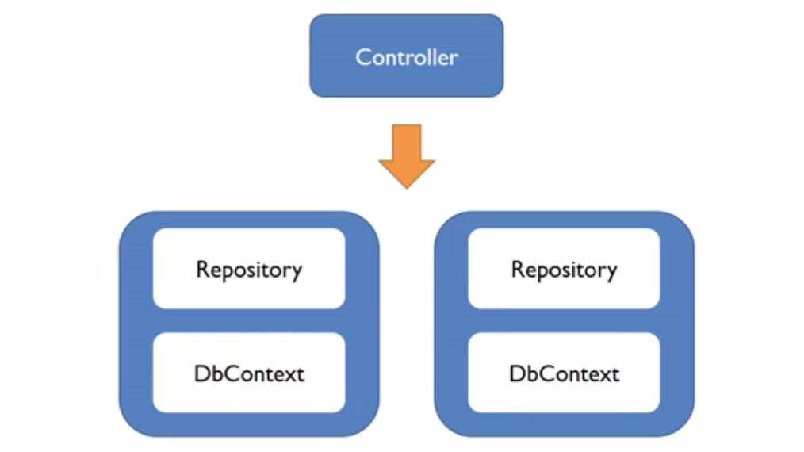
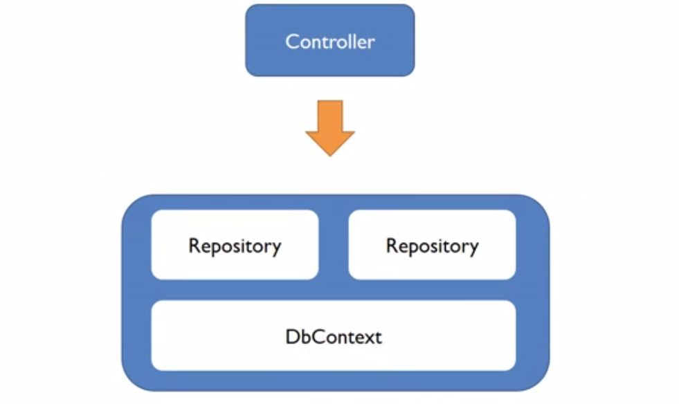
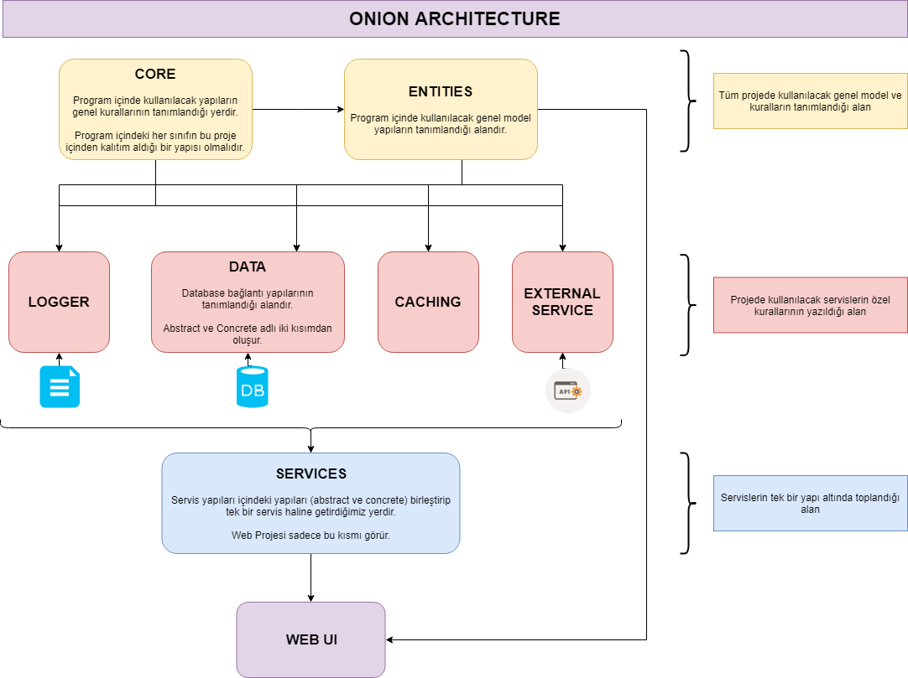

## DATABASE ENTEGRASYON MİMARİLERİ

- Database modellemesi yapılırken ve bu yapılar proje içinde kullanılırken kullanacağımız bu yöntemler, hem proje yönetilebilirliğini arttırmak hem de kod tekrarını engellemek için kullanacağımız yöntemlerdir.

### 01 - Kurumsal Mimari Yapısıyla Core Projesi Oluştumak

- Buradaki amaç, projemiz içindeki her katmanı ayrı bir library içinde kullanarak, projenin yönetilebilirliğini arttırmaktır.
- Bunun için, bir solution içinde açamız gereken temelde 3 tane proje vardır. Bunların biri `CoreMVC`, diğer ikisi ise `Class Library`'dir.
- Projeler oluşturulduktan sonra, her projenin kullanılan projeye göre birbirine referans vermesi gerekmektedir.
- Migration işlemleri yapılırken, assembly yolunun WebUI içinde olduğunu ayar olarak belirtmemiz gerekmektedir.

```cs
public void ConfigureServices(IServiceCollection services)
{
    services.AddMvc();
    services.AddDbContext<EfCoreDbContext>(
        option => option.UseSqlServer(
            Configuration.GetConnectionString("EfCoreDb"),
            b => b.MigrationsAssembly("Project.WebUI")
            ));
}
```

1. **Project.WebUI** (Core MVC Projesi)
    - Bu proje, bizim çalışacak main projemizdir.
    - Diğer projelerden referans alır ve kullanır.
    - Projenin çalışması için bu projenin start-up project olarak seçilmesi gereklidir.
2. **Project.Entity** (Class Library)
    - İçinde db modellerimizin olduğu sınıftır.
3. **Project.Data** (Class Library)
    - Database bağlantılarının bulunduğu alandır.
    - Database bağlantısı yapılacağı için içinde Entity Framework Core kütüphanesi bulunmalıdır.
        - NPM içinden `Microsoft.EntityFrameworkCore.SqlServer` kütüphanesi kurulabilir.
        - NPM Console üzerinden `Install-Package Microsoft.EntityFrameworkCore.SqlServer` komutu çalıştırılarak kurulabilir.
        - `Project.Data.csproj` dosyası içindeki `<itemgroup>` tagları içine aşağıdaki satır eklenebilir.
            - `<PackageReference Include="Microsoft.EntityFrameworkCore.SqlServer" Version="2.0.1" />`
            - ya da 
            - `<PackageReference Include="Microsoft.AspNetCore.All" Version="2.0.5" />`
    - İçinde 2 tane dizin bulundurur.
        1. **Abstract** 
            - Interface'lerin tanımlandığı alandır.
        2. **Concrete**
            - Database bağlantıları için yazılacak `Context` ve `Repository` sınıflarının olacağı klasördür.
            - Projeye dahil edilecek her bir db ve orm teknolojisi için ayrı bir klasör oluşturur. 
            - Bu klasörler içinde bağlantı için gereken Context ve Repository sınıfları oluşturulur.


### 02 - Generik Class Yapılarıyla Entegrasyon

- Generik sınıfların oluşturulması, kod tekrarını engellemek ve DRY prensibine uygun olarak kod yapıları oluşturmamızı sağlar.
- Proje içinde `Interface`'lerin ve `Repository` sınıflarının içeriği genel olarak birbirini tekrar eder. 
- Bunu engellemek için iki yapı için de birer generik sınıf oluşturulur.

#### Generik Intarface oluşturma

- Her repository için ayrı ayrı Interface oluşturmak yerine, eğer tüm interface içerikleri aynı olacaksa, tek bir tane `Generic Interface` oluşturulabilir.
- Diğer interface'ler bundan türetilir.
- Eğer interface'e özel eklemeler yapılacaksa bunlar kendi içinde yapılabilir.

```cs
public interface IGenericRepository<T> where T:class
{
    T GetByID(int ID);
    IQueryable<T> GetAll();
    IQueryable<T> Find(Expression<Func<T, bool>> query);

    void Add(T entity);
    void Update(T entity);
    void Delete(int ID);
    void Save();
}

public interface IPersonRepository : IGenericRepository<Person>
{
    IQueryable<Person> PersonsWithAddress { get; }
}

public interface IAddressRepository : IGenericRepository<Address>
{
    IQueryable<Address> AddressesWithPeople { get; }
}
```

#### Generik Repository oluşturma

- Aşağıda da görüldüğü gibi, generi interface işlemleri aynı olduğu gibi, bunların repository işlemleri de aynı. Bu nedenle bu interface içindeki ifadelerin repo işlemleri generik bir sınıf içinde yapılmıştır.
- **NOT:** Bu generik sınıf içinde kullanılan database sınıfının özel olmasına gerek yok. O yüzden bizim db bağlantı sınıfımız olan `EfProjectContext` sınıfını değil, bu sınıfın kalıtım aldığı ve EF içinden gelen `DbContext` sınıfını kullanmıştır.
    - Bu generik sınıfı kullanan diğer özel sınıflardan bu kullanılan `DbContext` ifadesi için ctor metot içinde `EfProjectContext` yapısı gönderilmiştir.
    - Bu saydede özel sınıf içine inherit edilen generik sınıf metotları bu özel db class yapısını kullanır.
- Özel sınıflar içinde db işlemleri kullanılırken, generik sınıftan inherit edilen `context` nesnesi kullanılabileceği gibi, bu nesne farklı bir nesneye tür dönüşümü yapılarak atanıp da kullanılabilir.
    - Yeni bir nesneye atanmadan;
        - `context.Set<Person>().Include("Address");` 
    - Yeni bir nesneye atanırsa;
        - `efProjectContext.Persons.Include("Address");`
    - Yeni nesneye atama yapılması, bu yapıyı kullanırken daha efektif kullanmamızı sağlar.

```cs
public class EfGenericRepository<T> : IGenericRepository<T> where T : class
{
    protected readonly DbContext context;

    public EfGenericRepository(DbContext ctx)
        => context = ctx;

    public T GetByID(int ID)
        => context.Set<T>().Find(ID);

    public IQueryable<T> Find(Expression<Func<T, bool>> query)
        => context.Set<T>().Where(query);

    public IQueryable<T> GetAll()
        => context.Set<T>();

    public void Add(T entity)
        => context.Set<T>().Add(entity);

    public void Delete(int ID)
        => context.Set<T>().Remove(GetByID(ID));

    public void Update(T entity)
        => context.Set<T>().Update(entity);

    public void Save()
        => context.SaveChanges();
}

public class EfPersonRepository : EfGenericRepository<Person>, IPersonRepository
{
    public EfPersonRepository(EfProjectContext ctx) 
        : base(ctx) { }

    public EfProjectContext efProjectContext
    { get { return context as EfProjectContext; } }

    public IQueryable<Person> PersonsWithAddress
        => efProjectContext.Persons.Include(k => k.Address);
}

public class EfAddressRepository : EfGenericRepository<Address>, IAddressRepository
    {
        public EfAddressRepository(EfProjectContext ctx)
            : base(ctx) { }

        public EfProjectContext _EfProjectContext
        { get { return context as EfProjectContext; } }

        public IQueryable<Address> AddressesWithPeople
            => _EfProjectContext.Addresses.Include(k => k.Persons);
    }
```

### 03 - Unit Of Work Pattern

- Bu yapının temel olarak amaçları;
    - Controller içine repoları ayrı ayrı DI yapmak yerine, tek bir yapı altında toplayıp enjekte etmek.
    - Ayrı ayrı enjekte edilen yapıların ayrı ayrı DbContext öğeleri oluşturmak yerine, sadece bir tane nesne oluşturup bunun üzerinde işlemler yapmak. 
- Burada asıl olarak yaptığımız, tüm repository öğelerini tek bir öğe halinde birleştirmek ve bu öğenin hizmetine tek bir tane DbContext öğesi atamaktır.

| <center>Wihtout UoW</center> | <center>With UoW</center> |
| --- | --- |
| <p align="center"></p> | <p align="center"></p> |

#### Interface yapılandırılması

- Oluşturacağımız interface, 
    - Proje içinde kullandığımız sanal interface tablolarını alan, 
    - Dispose edilebilir,
    - İçinde tüm işlemler bittikten sonra db kaydını gerçekleştirebileceğimiz bir SaveChanges metodu bulunduran bir yapıda olmalıdır.

```cs
interface IUnitOfWork : IDisposable
{
    IPersonRepository People { get; }
    IAddressRepository Addresses { get; }

    int SaveChanges();
}
```

#### Interface üzerinden sınıf türetilmesi

- Öncesinde oluşturduğumuz interface'i, mevcut kullandığımız db yapısına uyarlamak için yeni bir class oluşturuyoruz.
- Bu yeni class içinde;
    - Mevcut database yapımızı DI ile enjekte ediyoruz.
    - Bu yapıyı kullanacak her controller, sınıf içinde birden fazla repo oluşturmasın diye, her repodan bir private nesne oluşturuyoruz ve her nesne için bir `get` property'si oluşturup bu field nesnelerini gönderiyoruz.
        - Bu propery'ler oluşturulurken, ilk ulaşıldığında field alanları null olacağından dolayı, bu field'lar için yeni bir nesne oluşturup gönderiyoruz.
    - Daha sonrasında db kaydı için `SaveChanges` metodunu ve işimiz bittikten sonra bunu silmek için `Dispose` metodunu dolduruyoruz.

```cs
public class EfUnitOfWork : IUnitOfWork
{
    // Database
    private readonly EfProjectContext context;

    public EfUnitOfWork(EfProjectContext _context)
        => context = _context;

    // Fields
    private IPersonRepository _people;
    private IAddressRepository _addresses;

    // Properties
    public IPersonRepository People
        => _people ?? (_people = new EfPersonRepository(context));

    public IAddressRepository Addresses
        => _addresses ?? (_addresses = new EfAddressRepository(context));

    // Functions
    public int SaveChanges()
        => context.SaveChanges();

    public void Dispose()
        => context.Dispose();
}
```

#### Yapıların birbirine bağlanması

- Repolarda olduğu gibi, `Startup.cs` dosyası içinde bu iki yapının birbirine bağlanması lazım.

```cs
services.AddTransient<IUnitOfWork, EfUnitOfWork>();
```

> **NOT!** Tüm repoları ve tüm interface'leri tek bir çatı altına toplayıp `Unit of Work` yapısıyla birbirine bağladığımız ve kullanacağımız alanlarda **diğer interfaceleri değil de UoW interface'ini enjekte edeceğimiz için** `Startup.cs` dosyası içindeki diğer bağlantıları kaldırabiliriz.

```cs
// Öncesi
services.AddTransient<IPersonRepository, EfPersonRepository>();
services.AddTransient<IAddressRepository, EfAddressRepository>();
```

```cs
// Sonrası
services.AddTransient<IUnitOfWork, EfUnitOfWork>();
```

#### Son durum

UoW öncesi Controller:

```cs
public class Home2Controller : Controller
{
    private IPersonRepository person;
    private IAddressRepository address;

    public Home2Controller(IPersonRepository _person, IAddressRepository _address)
    {
        person = _person;
        address = _address;
    }

    public IActionResult People()
        => View(person.PersonsWithAddressWithCountry);

    public IActionResult Addresses()
        => View(address.GetAll());

    public IActionResult AddPerson(Person model)
    {
        person.Add(model);
        person.Save();
        return RedirectToAction("People");
    }
}
```

UoW sonrası Controller : 

```cs
public class Home2Controller : Controller
{
    private IUnitOfWork uow;

    public Home2Controller(IUnitOfWork _uow)
        => uow = _uow;

    public IActionResult People()
        => View(uow.People.PersonsWithAddressWithCountry);

    public IActionResult Addresses()
        => View(uow.Addresses.GetAll());

    public IActionResult AddPerson(Person model)
    {
        uow.People.Add(model);
        uow.SaveChanges();
        return RedirectToAction("People");
    }
}
```


### 04 - Onion Architecture

- Katmanların iç içe olduğu ve her katmanın sadece kendi üstündeki katmanı gördüğü tasarım mimarisidir.

<p align="center">
    
</p>