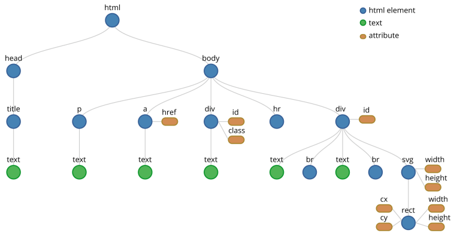

## JQUERY İLE AJAX İŞLEMLERİ

- DOM ( Documet Object Model ) Nedir?
    - DOM, HTML ile programlama dilleri arasında bir standart oluşturarak bu dillerin HTML den bilgi alıp, bilgi vermesine yardımcı olur. DOM, Nesneler ve özelliklerden oluşur.
    - DOM’da HTML ile hazırladığınız sayfa, belge; bu belgenin içine yerleştirdiğiniz her türlü öğe ise nesne olarak adlandırılır.
    - DOM da nesnelerin birer öğe (element) olarak kullanılabilmesi için hiyerarşik bir düzen izlenerek çağrılmaları gerekir.

<p align="center">
    
</p>

#### Klasik Ajax işlemleri

```html
<input type="text" id="input" /> <br />
<button id="btn">Çağır</button><br /><br />
<p id="yazi">Veri alınmadı!</p>

<script>
    var btn = $("#btn");
    var yazi = $("#yazi");
    var input = $("#input");

    btn.click(function () {
        $.ajax({
            url: "/Home/ajax1",
            data: { data: input.val() },
            type: "POST",
            success: function (gelenVeri) {
                yazi.html(gelenVeri);
            },
            error: function () {
                alert("Ajax hatası!");
            }
        });
    });
</script>
```

- Ajax ile gelen veri birden çok yapıda olabilir ve kullanımı da gelen bu yapıya göre değişir.
    - String döndüren ajax
    - Html döndüren ajax
    - Model döndüren ajax
    - Model Listesi döndüren ajax
    - PartialView döndüren ajax
    - $.each metodu

```js
$.each(data, function (index, value) {
    liste.append("<li>" + value.Isim"</li>");
});
```

- Kaynak : 
    - http://api.jquery.com/jQuery.ajax/


#### $.load() fonksiyonu

- load() metodu ile veri gönderirsek “post” olarak otomatik gönderir. Veri göndermediğimiz ve sadece veri çektiğimiz durumlarda, “get” gönderimi yapar.

```js
yazi.load("/Home/ajax1", { data: input.val() }, 
function (responseTxt, statusTxt, xhr) {
    if (statusTxt == "success")
        alert("External content loaded successfully!");
    if (statusTxt == "error")
        alert("Error: " + xhr.status + ": " + xhr.statusText);
});
```

- Kaynaklar :
    - https://www.w3schools.com/jquery/ajax_load.asp
    - http://api.jquery.com/load/

#### $.get ve $.post işlemleri

```js
// Kullanımı
$.get(URL,callback);
$.post(URL,data,callback);

// Örnek
$.post("/Home/ajax2", function (data, status) {
    $.each(data, function (index, value) {
        liste.append("<li>" + value.Isim + "</li>");
    });
}).done(function () {
    alert("Ajax method başarıyla çalıştı!");
}).fail(function () {
    alert("Bir hata oluştu!");
}).always(function () {
    alert("Her zaman gösterilecek!")
});
```

- Deferred Object Yapıları
    - .done(), .fail() ve .always() 
- Kaynaklar :
    - https://www.w3schools.com/jquery/jquery_ajax_get_post.asp
    - https://api.jquery.com/category/deferred-object/
